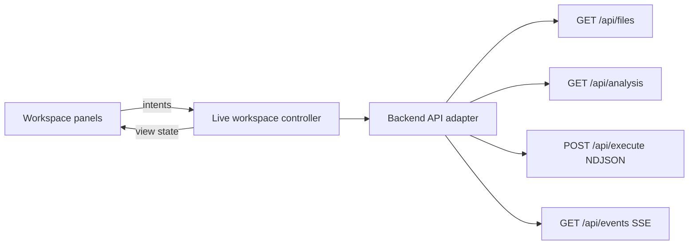
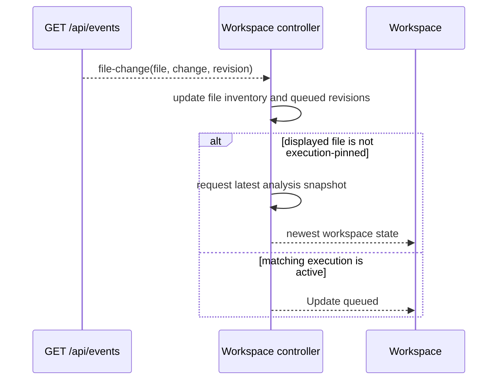

# Connect the Runtime Visualizer Workspace to Live Backend Data

## System Design

### One workspace controller owns the live domain state

The browser will use one live-workspace controller as the coordination boundary for files, Procedure selection, source, CFG, revisions, diagnostics, executions, and file-change events. Presentational panels receive projected state and dispatch typed intents; they do not fetch backend data or maintain competing domain copies.



The controller is the sole owner of selection and displayed revision. It coordinates request ordering, retains the last useful loaded workspace during disconnection, queues the newest file revision while matching executions are active, and routes execution events only to executions pinned to the matching file, Procedure, and revision. The backend remains the authority for source, analysis, revision validity, execution, and file-change events; this change adds browser orchestration without changing those domain contracts.

### One stateless analysis request returns a consistent saved-project snapshot

The browser loads the file inventory independently, then requests one backend-owned analysis snapshot for the selected saved file and Procedure:

```text
GET /api/files
  -> choose or preserve selected file

GET /api/analysis?file=...&name=...&showImports=...
  -> {
       file,
       procedure,
       revision,
       source,
       procedures,
       cfg,
       diagnostics
     }
```

The analysis module reads one project snapshot, derives the source, Procedures, diagnostics, and CFG from that snapshot, stores its executable revision, and returns one revision-consistent result. It is stateless with respect to the browser: it does not remember selection, choose display timing, queue updates, or track visible runs. Those remain controller responsibilities.

The endpoint is named `analysis`, not `workspace`, to keep its interface domain-led. Existing resource endpoints remain available for other consumers. The browser does not use inline-source analysis or execution. `POST /api/cfg` is outside the saved-file product contract and should be removed in a separate cleanup after repository-wide consumers are verified.

### One controller-wide SSE subscription observes all file changes

The controller opens one `GET /api/events` SSE connection while connected and filters each global `file-change` event against the current workspace and active execution pins. It closes the connection when the browser workspace is disposed and reconnects after transport failure with bounded backoff.



Added files update the selector without changing the current selection. Changes to unrelated files do not disturb the displayed workspace. Changes to the displayed file refresh immediately unless a matching execution pins the displayed revision; in that case only the newest revision is retained until all matching executions terminate. Deleted files and removed Procedures follow the selection rules in the product design.

### The server assigns execution identity

Each accepted execution receives a server-generated `executionId`. The controller uses that identity as the stable key for active and terminal run records, while storing the file, Procedure, and revision requested for that execution. This makes overlapping executions distinguishable across browser components and leaves execution identity authoritative at the execution boundary.

```text
ExecutionRecord {
  executionId: string        // server-generated
  file: string
  procedure: string | null
  revision: string
  status: Running | Succeeded | Failed | Interrupted
  currentNodeId?: string
  error?: string
}
```

The existing execution behavior remains revision-bound: the server executes the stored snapshot identified by the requested file, Procedure, and revision, and emits ordered node events followed by one terminal result. The browser does not manufacture or renumber server executions.

### The existing NDJSON stream carries identity in a response header

`POST /api/execute` remains a single streaming request. The server allocates an execution ID before starting the worker and returns it in the response headers; the body continues to contain ordered node records followed by one terminal result.

```text
POST /api/execute
  request:  { file, name?, revision }
  response: 200 application/x-ndjson
             X-Execution-Id: <server-generated-id>
             {"event":"node","data":{"nodeId":"..."}}
             {"event":"result","data":{"status":"Succeeded"}}
```

This avoids a second execution lifecycle API while giving the controller a stable server-owned key as soon as the stream starts. A transport failure before a terminal result is represented locally as `Interrupted`; the controller never retries the same execution or silently starts a replacement.

### Disconnection retains useful content but suspends live actions

When the API or event connection is unavailable after content has loaded, the controller keeps the last source and CFG visible as retained context, marks the workspace `Reconnecting`, and disables actions that require current backend state: file and Procedure changes, graph refresh, and new execution. Retained content is not presented as current.

An active execution whose stream ends before a terminal result becomes `Interrupted`, and its graph marker is cleared. The controller does not retry or replace it. Once connectivity returns, the controller refreshes the file inventory and reloads the selected file and Procedure from the backend. If the selection no longer exists, normal deletion handling chooses the next available file or the empty state.

### Reconnection is automatic with bounded backoff

The controller retries the SSE connection and failed live refreshes automatically using bounded exponential backoff. A successful connection resets the delay. Reconnection never starts an execution, substitutes demonstration data, or hides the `Reconnecting` state. A visible Retry action remains available for an immediate attempt without changing the automatic policy.

## Program Design

### A framework-independent controller makes orchestration directly testable

The browser application boundary is a framework-independent controller. React subscribes through a thin hook and renders projected state; it does not own request, stream, retry, revision-pinning, or execution policy.

```tsx
function LiveProcedureWorkspace() {
  const workspace = useWorkspaceController(workspaceController)
  return <WorkspaceView state={workspace.state} actions={workspace.actions} />
}
```

```text
createLiveWorkspaceController
  receives analysisGateway   -> loads saved-project snapshots
  receives executionGateway  -> starts and observes revision-bound executions
  receives fileEventsGateway -> observes filesystem invalidations
  receives retryScheduler    -> controls bounded reconnection timing

  exposes getState()
  exposes subscribe(listener)
  exposes selectFile(file)
  exposes selectProcedure(name)
  exposes setShowImports(show)
  exposes runProcedure()
  exposes selectExecution(executionId)
  exposes retry()
  exposes dispose()
```

The controller owns the application state machine and delegates transport details to gateways. Its public methods are semantic workspace operations, not reducer actions; the reducer or transition mechanism remains private. `useWorkspaceController` only adapts `subscribe` and `getState` to React and maps presentation events to these operations. This keeps the highest-risk behavior testable without DOM timing, a browser, or a live server.

### The browser uses a feature-driven live-workspace module

The browser groups the page, its components, use cases, controller, and focused tests under one feature. Code that is not specific to the live workspace belongs under `browser/src/shared`; cross-package transport vocabulary remains in `packages/contracts`.

```text
browser/src/
├── pages/
│   └── liveWorkspace/
│       ├── liveWorkspace.page.tsx
│       ├── liveWorkspace.page.spec.ts
│       ├── components/
│       │   ├── controlFlowGraph/
│       │   ├── diagnostics/
│       │   ├── navigation/
│       │   ├── runInspector/
│       │   ├── sourcePanel/
│       │   └── workspaceHeader/
│       └── useCases/
│           ├── createLiveWorkspaceController.ts
│           ├── liveWorkspace.state.ts
│           ├── liveWorkspace.types.ts
│           ├── useWorkspaceController.ts
│           └── index.ts
└── shared/
    ├── api/
    │   ├── analysisGateway.ts
    │   ├── executionGateway.ts
    │   └── fileEventsGateway.ts
    ├── components/
    ├── config/
    ├── hooks/
    ├── testing/
    │   └── Spy.ts
    └── retry/
```

The feature owns live-workspace policy and presentation. Shared API adapters implement transport interfaces, shared generic UI remains reusable, and shared testing utilities contain only reusable test infrastructure. The existing generated monolith is replaced by the feature page and its components rather than becoming a new top-level shared component.

Feature-specific typical tests are co-located with their subjects. Gherkin bindings remain in `browser/tests/acceptance` because they are runner adapters, not feature implementation files.

```text
browser/src/pages/liveWorkspace/
├── liveWorkspace.page.tsx
├── liveWorkspace.page.spec.ts
├── components/
│   └── controlFlowGraph/
│       ├── ControlFlowGraph.tsx
│       └── ControlFlowGraph.spec.tsx
└── useCases/
    ├── createLiveWorkspaceController.ts
    ├── createLiveWorkspaceController.spec.ts
    └── index.ts

browser/tests/acceptance/
├── unit/live-workspace.hvut.ts
└── e2e/live-workspace.hve2e.ts
```

### The live-workspace feature owns its gateway interfaces

Gateway interfaces are feature-owned ports in `liveWorkspace.ports.ts`. Shared browser adapters implement those ports using HTTP, NDJSON, and SSE. The feature therefore states the behavior it needs without depending on transport vocabulary, while the shared adapters remain reusable infrastructure.

```text
browser/src/pages/liveWorkspace/useCases/
├── liveWorkspace.ports.ts       # feature-owned gateway interfaces
└── createLiveWorkspaceController.ts

browser/src/shared/api/
├── analysisGateway.ts            # HTTP adapter
├── executionGateway.ts           # NDJSON adapter
└── fileEventsGateway.ts          # SSE adapter
```

```ts
// liveWorkspace.ports.ts
export interface AnalysisGateway {
  load(input: AnalysisRequest, signal: AbortSignal): Promise<AnalysisResponse>
}

export interface ExecutionGateway {
  start(input: ExecuteInput): ExecutionStream
}
```

The hand-written in-memory spies implement the feature ports. Shared adapters may use the package-owned schemas and browser transport APIs, but those details do not leak into the controller interface.

### The page is the live-workspace composition root

`LiveWorkspacePage` constructs the feature controller with concrete shared adapters exactly once for its mounted lifetime. The controller receives only feature-owned ports; no global dependency registry or application container is introduced for this one feature.

```tsx
function LiveWorkspacePage() {
  const controller = useMemo(
    () =>
      createLiveWorkspaceController({
        analysisGateway: createAnalysisGateway(),
        executionGateway: createExecutionGateway(),
        fileEventsGateway: createFileEventsGateway(),
        retryScheduler: createRetryScheduler(),
      }),
    [],
  )

  return <LiveProcedureWorkspace controller={controller} />
}
```

Tests bypass this composition root and construct the controller with their in-memory spies. This creates one clear seam: the page selects adapters, while the controller owns workspace behavior.

### Construction starts the live controller

`createLiveWorkspaceController` starts initial file loading and the file-event subscription during construction. The React shell creates one controller for its mounted lifetime, subscribes to its immutable state, and calls `dispose()` on unmount.

```tsx
function LiveProcedureWorkspace() {
  const controller = useMemo(
    () => createLiveWorkspaceController(createBrowserDependencies()),
    [],
  )
  const state = useWorkspaceController(controller)

  useEffect(() => () => controller.dispose(), [controller])
  return <WorkspaceView state={state} controller={controller} />
}
```

Construction therefore has intentional I/O and timer effects. `dispose()` stops the SSE subscription, aborts pending browser requests where supported, and cancels scheduled reconnect attempts. Tests create a controller only after configuring its collaborators.

### Tests concentrate coverage at the controller and HTTP boundaries

Most frontend behavior is verified through high-value unit tests against the controller with hand-written in-memory gateway spies. These tests prove startup selection, revision pinning, newest-only queued refresh, overlapping executions, terminal outcomes, disconnection, interruption, and reconnection. They observe controller state and gateway communication rather than React implementation details.

```text
controller HVUTs
  subject: createLiveWorkspaceController
  doubles: in-memory gateway and scheduler spies
  proves: application policy and state transitions

backend incoming-adapter integrations
  subject: real Fastify route + application workflow
  proves: HTTP contracts and revision consistency

browser HVE2E
  subject: real browser + backend
  proves: a small set of critical operator journeys
```

New HTTP-boundary integration tests use an explicit subtype suffix while remaining in the existing Vitest integration project:

```text
backend/tests/typical/integration/
├── analysis.incoming-adapter.integration.ts
└── execution.incoming-adapter.integration.ts
```

`analysis.incoming-adapter.integration.ts` verifies that `GET /api/analysis` returns one revision-consistent snapshot and maps diagnostics correctly. `execution.incoming-adapter.integration.ts` verifies `X-Execution-Id`, ordered NDJSON records, one terminal result, and errors that occur before streaming starts. The descriptive suffix is preferred over an `iai` abbreviation.

Browser HVE2E coverage uses exactly three critical journeys: select a saved file, inspect its graph, run it, and observe completion; receive diagnostics while source remains visible and Run is disabled; and queue a file update behind a matching execution until it reaches a terminal result. Controller tests carry the edge-case matrix; E2E tests verify only wiring and visible behavior.

### Domain scenarios stay agnostic of the adapter and test level

Acceptance scenarios describe observable Runtime Visualizer behavior, not the adapter that proves it. The same scenario may be bound by the backend, the browser controller, a browser E2E suite, or a future mobile client. Scenario text must not name React, Fastify, HTTP, SSE, NDJSON, test doubles, or test levels.

```gherkin
Scenario: Keep a displayed execution revision stable
  Given an Operator is viewing a Procedure revision
  And that revision has a running Execution
  When the Procedure source changes
  Then the displayed Procedure revision remains unchanged
  And the newest update is queued
  When every Execution for that revision reaches a terminal outcome
  Then the workspace displays the newest Procedure revision
```

Bindings decide their subject and collaborators: controller HVUTs use gateway spies, Fastify incoming-adapter integrations use route collaborators, and HVE2E uses real browser and backend seams. Existing root domain feature files are extended where the behavior belongs to their established vocabulary. New feature files are created only for a genuinely new domain use case, never to label a technical layer.

Revision pinning, queued refresh, and terminal refresh extend `features/observe-execution.feature`. They are execution-observation behavior, not a browser-specific feature. The browser controller and browser E2E bindings prove the same scenarios at their respective seams.

### One shared test-spy base supports all controller collaborators

The browser adds a generic `Spy<T>` test-support base class. Each controller collaborator has a hand-written in-memory spy that extends it and implements the production interface. The spies provide controlled indirect input and record controller communication; controller HVUTs use state or communication verification as the scenario requires.

```text
browser/tests/support/
├── Spy.ts
├── InMemoryAnalysisGatewaySpy.ts
├── InMemoryExecutionGatewaySpy.ts
├── InMemoryFileEventsGatewaySpy.ts
└── InMemoryRetrySchedulerSpy.ts
```

```ts
export class InMemoryAnalysisGatewaySpy
  extends Spy<AnalysisGateway>
  implements AnalysisGateway {
  // supplies snapshots and records analysis requests
}
```

`InMemoryAnalysisGatewaySpy` supplies snapshots or failures and records selected file and Procedure requests. `InMemoryExecutionGatewaySpy` supplies server execution IDs, emits ordered stream records, and records revision-pinned requests. `InMemoryFileEventsGatewaySpy` emits file changes and records subscription disposal. `InMemoryRetrySchedulerSpy` records scheduled callbacks and runs only the callback selected by the test. Incoming-adapter integration tests remain free to use `vi.fn()` for Fastify route collaborators.

### Shared runtime schemas form a package-owned transport boundary

A dedicated workspace package owns the runtime schemas shared by browser and backend. It defines the analysis response, execution header and event records, and source-change event data. The backend validates and serializes responses through these schemas; browser gateways parse every response and stream record through the same schemas before exposing typed values to the controller.

```text
packages/contracts/
├── package.json
└── src/
    ├── analysis.ts      # GET /api/analysis request and response
    ├── execution.ts     # execution ID and NDJSON event records
    ├── file-events.ts   # SSE file-change payload
    └── index.ts         # package public API
```

```ts
import {
  AnalysisResponseSchema,
  ExecutionEventSchema,
  FileChangeEventSchema,
} from "@runtime-visualizer/contracts"
```

The root workspace configuration expands to include `packages/*`. The contracts package contains only transport vocabulary and validation; it does not import Fastify, React, filesystem code, or controller policy. This keeps the browser independent of the backend implementation package while making the HTTP boundary both compile-time typed and runtime checked.

### One immutable state snapshot keeps every panel revision-consistent

The controller publishes one immutable workspace state through one subscription. React reads that snapshot atomically, so source, graph, selection, connection state, and matching execution markers cannot render from incompatible controller updates.

```ts
type LiveWorkspaceState = {
  connection: ConnectionState
  selection: SelectionState
  analysis: AnalysisState
  executions: readonly ExecutionRecord[]
  queuedRefresh?: QueuedRefresh
}

interface LiveWorkspaceController {
  getState(): LiveWorkspaceState
  subscribe(listener: () => void): () => void
  dispatch(intent: WorkspaceIntent): void
  dispose(): void
}
```

The controller replaces the full state after each transition. Selectors that derive source, graph, and visible execution markers operate only on this snapshot. This makes controller tests assert whole state transitions rather than coordinate several independent subscriptions.

### Presentation components replace the generated monolith in the same change

The integration splits the current generated workspace into a controller-bound shell and presentational panels. The shell is the only React component that calls the controller hook. Every child receives state projections and intent callbacks; no child imports transport gateways or holds duplicate workspace domain state.

```text
LiveProcedureWorkspace
  useWorkspaceController(controller)
  ├── WorkspaceHeader       # connection and refresh state
  ├── NavigationSidebar     # file, Procedure, and run selection intents
  ├── SourcePanel           # selected snapshot source
  ├── ControlFlowGraph      # generic CFG nodes, edges, and run markers
  ├── RunInspector          # active and terminal execution records
  └── DiagnosticsPanel      # analysis and transport failures
```

```tsx
<ControlFlowGraph
  cfg={state.analysis.cfg}
  executions={visibleExecutions(state)}
  selectedExecutionId={state.selection.executionId}
  onSelectExecution={actions.selectExecution}
/>
```

The refactor removes fixed demonstration files, Procedures, source, graph composition, runs, diagnostics, revisions, and simulated changes. It preserves the dark control-room layout and accessibility semantics while allowing the generic CFG model to determine rendered nodes and edges.

### The graph remains a dependency-free DOM and CSS renderer

`ControlFlowGraph` renders backend CFG nodes and edges directly with React and CSS. The integration does not add a graph library, automatic layout engine, pan/zoom system, or graph-search feature. It retains the current control-room visual language while replacing the fixed composition with data-driven elements.

```tsx
function ControlFlowGraph({ cfg, executions }: ControlFlowGraphProps) {
  return (
    <section aria-label="Control-flow graph">
      {cfg.nodes.map((node) => (
        <GraphNode
          key={node.id}
          node={node}
          markers={markersAt(node.id, executions)}
        />
      ))}
      {cfg.edges.map((edge) => (
        <GraphEdge key={`${edge.from}:${edge.to}`} edge={edge} />
      ))}
    </section>
  )
}
```

The first implementation uses a deterministic, simple layout suitable for the backend’s current CFG shapes. Complex edge routing, interactive graph navigation, and layout optimization remain out of scope rather than delaying live data integration.

### A fixed vertical flow is sufficient for the first live graphs

The renderer places graph nodes in source and CFG order within one vertical flow. It renders branches as adjacent children where the existing CSS permits; it does not calculate layers, resolve overlaps, or route arbitrary edges.

```text
Entry
  ↓
Statement
  ↓
Decision
 ↙     ↘
Then   Else
```

The graph remains readable for the initial supported examples with the least code. Larger or more complex CFGs may need a later layout-specific change; that limitation is explicit rather than hidden behind a partial layout algorithm.

### Zod schemas validate every shared transport value

`packages/contracts` uses Zod, which is already a backend dependency, to define runtime-valid schemas and infer the shared TypeScript types. Browser gateways parse HTTP bodies, execution headers and NDJSON records, and SSE payloads before passing values to the controller. Backend route adapters validate request input and serialize documented response shapes through the same package.

```ts
export const AnalysisResponseSchema = z.object({
  file: z.string(),
  procedure: ProcedureSchema,
  revision: z.string(),
  source: z.string(),
  procedures: z.array(ProcedureSchema),
  cfg: CfgSchema.nullable(),
  diagnostics: z.array(DiagnosticSchema),
})

export type AnalysisResponse = z.infer<typeof AnalysisResponseSchema>
```

Malformed transport data becomes a gateway or incoming-adapter error at the boundary; it never enters controller state as an unchecked value. The contracts package is the only shared runtime validation dependency added to the browser.

### Controller construction starts the live workspace immediately

Creating the controller starts initial file loading and the controller-wide file-event subscription. Production React creates it once when the workspace mounts and calls `dispose()` when the workspace unmounts.

```ts
const controller = createLiveWorkspaceController({
  analysisGateway,
  executionGateway,
  fileEventsGateway,
  retryScheduler,
})
// constructor starts loading and event observation
```

Tests inject hand-written gateway and scheduler spies before construction. Those spies control indirect inputs and record communication, so automatic startup remains deterministic under test without adding a production-only lifecycle call.

```ts
const analysisGateway = new AnalysisGatewaySpy()
const eventsGateway = new FileEventsGatewaySpy()

const controller = createLiveWorkspaceController({
  analysisGateway,
  executionGateway: new ExecutionGatewaySpy(),
  fileEventsGateway: eventsGateway,
  retryScheduler: new RetrySchedulerSpy(),
})

// state verification
expect(controller.getState().connection).toEqual("Loading")
```

`dispose()` still ends subscriptions, aborts pending transport where supported, and prevents later state publication.

### One analysis use case owns saved-project snapshot consistency

A new backend application use case, `analyseSavedProcedure`, is the sole composition boundary for the live analysis result. The Fastify route validates the request, delegates once, and serializes the shared response schema. It does not coordinate existing source and CFG use cases itself.

```text
GET /api/analysis
  analysis incoming adapter
    analyseSavedProcedure
      read saved project snapshot
      discover Procedures
      diagnose selected Procedure and dependencies
      build selected CFG
      store executable revision snapshot
      return AnalysisSnapshot
```

```ts
analyseSavedProcedure(input: {
  file: string
  name?: string
  showImports: boolean
}): Promise<AnalysisSnapshot>
```

`AnalysisSnapshot` contains the source, available Procedures, diagnostics, CFG when valid, and one revision derived from the same saved project snapshot. Existing source and CFG resource endpoints remain available for their consumers; they do not define the new use case’s consistency boundary.

### The dedicated analysis module coordinates existing source, CFG, and execution modules

`analyseSavedProcedure` spans three current modules: it uses source file reading and Procedure discovery from `source`, graph construction and diagnostics from `cfg`, and executable snapshot storage from `execution`. That cross-module orchestration belongs in one new, domain-led `analysis` module rather than in an HTTP adapter or inside one existing module.

```text
backend/src/modules/
├── analysis/
│   ├── http.ts
│   ├── index.ts
│   └── useCases/
│       └── analyseSavedProcedure/
│           └── analyse-saved-procedure.ts
├── cfg/          # graph and diagnostic capabilities
├── execution/    # revision storage and execution capabilities
└── source/       # saved file and Procedure capabilities
```

```text
analyseSavedProcedure
  source.readSource
  source.discoverProcedures
  cfg.analyseProject
  execution.RevisionStore.set
  -> AnalysisSnapshot
```

The analysis module owns no duplicate parser, CFG builder, filesystem reader, or revision store. It owns their one new composition: a revision-consistent analysis snapshot for a saved Procedure.

### Analysis diagnostics remain an HTTP `422` response

`GET /api/analysis` uses `200` only when it returns an executable analysis snapshot. Analysis diagnostics use the existing `422` boundary and a dedicated shared error schema. The `422` body includes the selected saved source context, so the browser can show the source and replace only the graph with diagnostics even on the first load. Run remains disabled.

```http
GET /api/analysis?file=src/main.ts&name=main&showImports=false

422 Unprocessable Entity
Content-Type: application/json

{
  "error": "Analysis failed",
  "file": "src/main.ts",
  "revision": "abc123",
  "source": "function main() { ... }",
  "procedures": [
    { "id": "top-level", "kind": "TopLevel", "name": null, "label": "Top level" }
  ],
  "diagnostics": [
    {
      "procedure": "main",
      "reason": "TypeError",
      "message": "...",
      "location": {
        "start": { "line": 3, "column": 1 },
        "end": { "line": 3, "column": 8 }
      }
    }
  ]
}
```

The incoming adapter validates both success and diagnostic responses through `AnalysisResponseSchema` and `AnalysisErrorSchema`. `AnalysisErrorSchema` contains `file`, `revision`, `source`, `procedures`, and `diagnostics`, but no CFG. Transport failures remain distinct from valid analysis diagnostics so the controller can show `Diagnostics` versus `Backend unavailable` without inferring meaning from a generic error string.

### Selection changes abort obsolete analysis requests

The controller aborts the previous analysis request when the selected file, Procedure, or imports setting changes. Each request also receives a monotonically increasing request ID; only the latest request may publish analysis state. The ID guard remains necessary because an adapter may resolve after aborting has begun.

```text
select(file, procedure)
  abort current analysis request
  requestId += 1
  set loading state for new selection
  request analysis with new AbortSignal and requestId

on analysis response
  if response.requestId is not latest
    ignore response
  else
    publish response
```

Controller tests use a deferred `AnalysisGatewaySpy` to resolve old and new requests in either order. They prove that a late response cannot replace the selected workspace, and that disposal aborts or ignores every pending request.

### A browser-session cache retains backend-returned analysis snapshots

The controller caches each successful analysis snapshot by its backend identity. Execution records reference the cache key rather than duplicate source and CFG data. Selecting an execution displays its cached snapshot without introducing a backend historical-revision endpoint.

```ts
type SnapshotKey = `${string}:${string}:${string}`
// file : Procedure ID : backend revision

type LiveWorkspaceState = {
  snapshots: ReadonlyMap<SnapshotKey, AnalysisSnapshot>
  executions: readonly ExecutionRecord[]
}

type ExecutionRecord = {
  executionId: string
  snapshotKey: SnapshotKey
  status: ExecutionStatus
  currentNodeId?: string
  error?: string
}
```

The cache is display-only. It cannot create, validate, or revive a backend revision. Every new execution still sends the backend-owned file, Procedure, and revision, and the backend may reject an unavailable revision. Cached snapshots disappear with the browser session; no `GET /api/revisions/:revision` endpoint is added.

The controller removes snapshots by reference. It retains a snapshot while it is displayed or referenced by any active or terminal execution. `Clear completed` removes terminal execution records, then removes each snapshot with no remaining execution reference unless that snapshot is still displayed. Several executions of one revision share one cache entry.

```text
clearCompleted
  remove terminal execution records
  referenced = displayedSnapshot + active snapshots + remaining terminal snapshots
  remove every cached snapshot not in referenced
```

### The execution gateway exposes ordered events as an async iterable

The browser execution gateway wraps the NDJSON `fetch` response as an async iterable. It returns the server-owned execution ID immediately, yields validated node and terminal events in wire order, and exposes cancellation for disposal or an interrupted stream.

```ts
interface ExecutionGateway {
  start(input: ExecuteInput): {
    executionId: string
    events: AsyncIterable<ExecutionEvent>
    cancel(): void
  }
}
```

```text
controller.startExecution
  executionGateway.start(input)
    -> server executionId
    -> for-await validated NDJSON events
       -> update matching ExecutionRecord
       -> stop at terminal result
    -> transport end before terminal result
       -> mark Interrupted
```

`InMemoryExecutionGatewaySpy` implements the same shape with a deferred async queue. Tests can emit overlapping node events, terminal success, terminal failure, stream errors, and completion in a controlled order without mocking browser callbacks.

### The file-event gateway exposes SSE as an abortable async iterable

The browser file-event gateway converts the long-lived SSE connection into an async iterable of validated `FileChangeEvent` values. The controller owns one `AbortController` for the subscription and stops iteration during disposal or before a bounded reconnect attempt.

```ts
interface FileEventsGateway {
  subscribe(signal: AbortSignal): AsyncIterable<FileChangeEvent>
}
```

```text
controller.observeFileChanges
  for-await gateway.subscribe(signal)
    file-change event -> update inventory or queue revision
    stream error      -> set Reconnecting and schedule retry
    disposal          -> abort signal and end iteration
```

`InMemoryFileEventsGatewaySpy` exposes a deferred event queue and records the abort signal. Tests can emit added, modified, and deleted files, close the stream, and assert that the controller updates state without opening one subscription per selected file.

### Retry timing is an injected, cancellable policy boundary

The controller receives a `RetryScheduler` instead of calling timer APIs directly. Production uses a timeout-backed implementation; controller tests use a scheduler spy that records delays and runs a chosen callback immediately when the scenario requires it.

```ts
interface RetryScheduler {
  schedule(delayMs: number, task: () => void): () => void
}
```

```text
on reconnect failure
  delay = min(baseDelay * 2^attempt, maxDelay)
  cancel previous retry if any
  retryCancel = scheduler.schedule(delay, reconnect)

on successful connection
  attempt = 0
  retryCancel = undefined

on dispose
  retryCancel?.()
```

The controller owns retry attempt state and the scheduler owns waiting. This keeps bounded-backoff policy visible in controller tests without sleeping or using global fake timers.

### Test assertions protect the live-workspace risks

```text
controller HVUT: start the workspace
  boundary: controller -> analysis and file-event gateway spies
  asserts: selects the first saved file and Top level Procedure, then publishes one executable analysis snapshot

controller HVUT: queue a changed displayed revision
  boundary: controller -> file-event and analysis gateway spies
  asserts: a matching active execution keeps its snapshot visible, replaces prior queued updates with the newest one, and refreshes only after every matching execution is terminal

controller HVUT: observe overlapping executions
  boundary: controller -> execution gateway spy
  asserts: each server execution ID updates only its own marker, terminal results clear only their marker, and terminal records remain until Clear completed

backend incoming-adapter integration: analyse saved Procedure
  boundary: GET /api/analysis -> analysis use case -> source, CFG, revision store
  asserts: success returns one revision-consistent snapshot; diagnostics return 422 with source context and no CFG

browser HVE2E: connected live workspace
  boundary: browser -> Vite proxy -> Fastify
  asserts: saved-file selection, diagnostic display with disabled Run, and queued refresh after execution completion are visible to an Operator
```

### Low-confidence decisions

- Fixed vertical CFG layout — it is intentionally the smallest implementation, but complex graphs with several joins or cross-edges may need a dedicated layout change after real workspace use.

## Patterns to Follow
