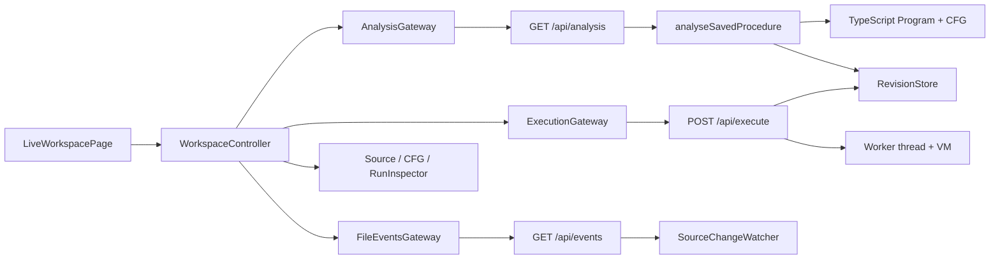

# Research: Live Execution Workspace

**Date**: 2026-09-02T10:20:06Z
**Git Commit**: d50ce27902173e8cfb66f0887d66b02a21c49012
**Branch**: prototype/49-execution-history-state-model
**Repository**: runtime-visualizer

## Research Question

1. How is the current browser Workspace structured, where is its state held, and which displayed values and interactions are fixed, local, or connected to backend data?
2. What HTTP and streaming endpoints expose files, source, Procedures, CFGs, diagnostics, executions, revisions, and source-change events?
3. How do source, analysis, CFG, execution, and revision-store modules model saved files, Procedure boundaries, dependencies, graph snapshots, and revision conflicts or expiry?
4. How does execution observation work, including ordering, current-node highlighting, terminal outcomes, failures, concurrent executions, disconnects, and source changes during execution?
5. Which feature files, tests, fixtures, startup configuration, and test-server wiring define observable live Workspace behavior, and where do UI assumptions differ?
6. What design-system and responsive patterns govern the Workspace?

## Research Methodology (verbatim)

This document will remain objective and factual. It does not contain any recommendations or implementation suggestions.
Open questions will not ask Why things haven't been built or what should be built in the future.

There is no "implementation" section - that is intentional.

## Summary

The repository contains two browser Workspace shapes. `App` renders `LiveWorkspacePage` in normal operation (`browser/src/App.tsx:1-26`), while the older generated `LiveProcedureWorkspace` remains a separate local-data component and is not imported by the normal app path (`browser/src/components/generated/LiveProcedureWorkspace.tsx:1-217`). The rendered page is a ports-and-adapters UI: a controller owns state and talks to analysis, execution, file-event, and retry gateways; React subscribes to that state (`browser/src/pages/liveWorkspace/liveWorkspace.page.tsx:12-35`, `browser/src/pages/liveWorkspace/useCases/liveWorkspace.ports.ts:1-24`).

Saved analysis is backend-owned. `GET /api/analysis` reads the selected file, discovers its top-level and named function Procedures, builds a dependency-aware CFG, returns source/revision/procedure metadata, and preserves source plus diagnostics on HTTP 422 (`backend/src/modules/analysis/http.ts:6-52`, `backend/src/modules/analysis/useCases/analyseSavedProcedure/analyse-saved-procedure.ts:13-130`). Successful analysis is stored as an immutable revision snapshot so `POST /api/execute` can run the displayed graph even after its backing file changes or disappears (`backend/src/modules/execution/infra/revision-store.ts:3-89`, `backend/src/modules/execution/useCases/executeProcedure/execute.ts:76-107`).

Execution is an NDJSON response stream. The server assigns an `X-Execution-Id`, emits ordered node events followed by one terminal result, and executes instrumented TypeScript in an isolated worker (`backend/src/modules/execution/useCases/executeProcedure/execute.ts:108-165`, `backend/src/modules/execution/useCases/executeProcedure/runner.ts:21-77`). The browser keys each execution by that ID, moves only that execution's current node on node events, clears the marker at a terminal result, and records interrupted streams separately (`browser/src/pages/liveWorkspace/useCases/createLiveWorkspaceController.ts:196-231`).

Filesystem observation is a polling-backed SSE stream. `GET /api/events` emits `file-change` records for added, modified, and deleted `.ts`/`.tsx` files; the browser adds files immediately, queues a selected-file revision while a matching run is active, and reloads after that run reaches a terminal state (`backend/src/modules/source/useCases/observeChanges/events.ts:8-34`, `browser/src/pages/liveWorkspace/useCases/createLiveWorkspaceController.ts:234-304`).

## Detailed Findings

### 1. The normal browser route renders a backend-connected page while the generated control-room mock remains local

`App` sets a light theme, exposes two development-only prototype query modes, and otherwise returns `LiveWorkspacePage` (`browser/src/App.tsx:1-26`). `main.tsx` disables Framer Motion animations when requested, force-removes the `dark` class, installs a broken-image fallback, and mounts React StrictMode (`browser/src/main.tsx:1-57`).

The live page creates default gateways and a controller once, subscribes to controller state, starts it on mount, and disposes internally-created controllers on unmount (`browser/src/pages/liveWorkspace/liveWorkspace.page.tsx:12-35`). Its rendered regions are:

```text
<LiveWorkspacePage>
  header: Runtime Visualizer / Live backend workspace
  navigation
    File select
    Procedure select
  main
    selected file + revision
    Source
    Diagnostics
    ControlFlowGraph
    Run Procedure
    RunInspector
```

The controller state is explicit and serializable: loading/ready/empty/error status; file list and selected file/Procedure; current analysis; revision-keyed snapshots; execution records; selected execution; connection state; queued revision; and selected-file deletion state (`browser/src/pages/liveWorkspace/useCases/liveWorkspace.types.ts:2-44`). Snapshot identity combines file, Procedure ID, and revision (`liveWorkspace.types.ts:35-44`).

The current page displays backend-derived files, selected source, revision, Procedure list, diagnostics, CFG nodes/edges, execution state, and connection/reconnect messages (`liveWorkspace.page.tsx:36-169`). Selecting a file or Procedure calls the controller, and the Run button sends the displayed analysis revision (`liveWorkspace.page.tsx:70-113,135-153`, `createLiveWorkspaceController.ts:307-347`). Visible graph markers are filtered to executions matching the currently displayed file, revision, and Procedure (`liveWorkspace.page.tsx:36-43`).

The generated component is a separate, fully local visual mock. It initializes hard-coded runs, source lines, file options, Procedure options, revision `a91c4e`, and a queued update; its controls mutate React-local state and `startRun` creates a synthetic run without a gateway (`browser/src/components/generated/LiveProcedureWorkspace.tsx:1-217`). It contains a richer dark control-room presentation—responsive rail, source toggle, graph controls, diagnostics drawer, and run detail—but normal `App` does not render it.

#### Testing patterns

The browser controller acceptance-unit suite injects in-memory analysis, file-event, and execution-stream spies, rather than rendering the generated component. It verifies overlapping execution IDs, terminal retention/clearing, late subscribers, queued revisions, top-level Procedure naming, added files, reconnecting, and interrupted execution streams (`browser/tests/acceptance/unit/live-workspace.hvut.ts:1-233`). The live page's saved-file behavior is exercised through Playwright BDD (`browser/tests/acceptance/e2e/live-workspace.hve2e.ts:20-82`).

### 2. Saved analysis returns a complete source-and-graph snapshot and keeps diagnostics displayable

The saved analysis endpoint is `GET /api/analysis?file=<path>&name=<identifier>&showImports=<boolean>`. The route validates a non-empty file, an optional JavaScript identifier, and a boolean-like `showImports`; invalid queries return 400 (`backend/src/modules/analysis/http.ts:6-52`). The use case reads the source, discovers Procedures, reads all supported files with up to eight concurrent readers, computes a workspace-manifest revision, and analyzes the selected file plus resolved dependencies (`analyse-saved-procedure.ts:42-100,144-162`).

A successful `AnalysisResponse` has this shape (`packages/contracts/src/analysis.ts:3-72`):

```text
{
  file, procedure, revision, source,
  procedures: ProcedureResource[],
  cfg: ControlFlowGraph | null,
  diagnostics: GraphDiagnostic[]
}
```

Diagnostics return HTTP 422 with `{ error, file, revision, source, procedures, diagnostics }`; the browser gateway converts that response into a normal analysis value with the first discovered Procedure and `cfg: null`, allowing source and diagnostics to remain visible (`backend/src/modules/analysis/useCases/analyseSavedProcedure/analyse-saved-procedure.ts:84-130`, `browser/src/shared/api/analysisGateway.ts:47-61`). The page consequently renders a diagnostics alert and disables Run Procedure when no CFG exists (`browser/src/pages/liveWorkspace/liveWorkspace.page.tsx:114-153`).

The lower-level endpoints are `GET /api/source?file=...`, which returns `{ file, source, revision }`, and `GET /api/procedures?file=...&name=...`, which returns file/revision, discovered Procedures, and an optional missing-name diagnostic (`backend/src/modules/source/useCases/readSource/source.ts:15-46`, `backend/src/modules/source/useCases/readSource/read-source.ts:58-94`). `GET /api/cfg?file=...&name=...&showImports=...` reads the saved workspace, returns `{ ok:true, file, revision, cfg }`, or returns 422 diagnostics; without `file` it returns usage information. Its POST form accepts inline `{ source, filePath?, functionName?, showImports?, files? }` and returns `{ ok:true, cfg }` or 422 diagnostics (`backend/src/modules/cfg/useCases/analyseProject/cfg.ts:15-124`).

#### Testing patterns

Backend incoming-adapter integration tests cover valid saved analysis, diagnostics with source context, top-level default selection, missing file query, dependency-sensitive revisions, and stable repeated revisions (`backend/tests/typical/integration/analysis.incoming-adapter.integration.ts:8-151`). The browser analysis gateway acceptance unit specifically verifies that a 422 retains source, Procedures, diagnostics, and a null CFG (`browser/tests/acceptance/unit/analysis-gateway.hvut.ts:1-40`).

### 3. The CFG is a selected Procedure graph over a dependency-aware virtual TypeScript Program

`ProcedureResource` distinguishes `TopLevel` and `Function`; the default resource is `top-level`, and named function declarations receive stable name-based IDs with a source-position suffix for duplicate names (`backend/src/modules/source/useCases/discoverProcedures/discover-procedures.ts:4-47`). Selecting a named function causes CFG construction to use that function body; otherwise it uses file statements. Imports can be added as contextual nodes, but imported Procedures stay separate scopes (`backend/src/modules/cfg/useCases/analyseFile/file-analyzer.ts:37-75`).

The public graph model includes nodes with stable IDs, kind, label, source location, and source text; edges with source/target IDs and optional semantic kinds/labels; and Procedure metadata such as entry, exit, parameters, async/generator/export flags (`backend/src/modules/cfg/types.ts:21-128`). The analyzer represents entry/exit, statements, branches, switch/case/default, returns, throws, breaks, continues, try/catch/finally, imports, and other runtime control-flow constructs (`backend/src/modules/cfg/useCases/analyseFile/file-analyzer.ts:42-312`). TypeScript-only declarations, imports in the execution flow, function declarations, empty statements, and `declare` forms are omitted; `with` throws a graph-generation error (`file-analyzer.ts:119-157,196-205`).

Dependency analysis virtualizes supplied files below `/runtime-visualizer`, resolves relative exact/`.ts`/`.tsx`/`.d.ts` candidates, and diagnoses only the selected file and files reached by its TypeScript Program (`backend/src/modules/cfg/diagnostics.ts:21-84`). Diagnostic reasons distinguish invalid syntax, type-checking failures, unresolved dependencies, and unsupported `with`; locations and dependency names are included (`diagnostics.ts:31-49,105-132`).

```text
saved files
   │ read + virtualize
   ▼
TypeScript Program ──diagnose selected/dependency files──▶ diagnostics
   │ no errors
   ▼
selected file + selected function body ──▶ ProcedureCfg
   │
   ├── RevisionStore snapshot
   └── AnalysisResponse to browser
```

#### Testing patterns

CFG behavior is covered by backend typical unit and integration suites, including `backend/tests/typical/unit/file-analyzer.unit.ts`, `backend/tests/typical/integration/backend-cfg.integration.ts`, `backend/tests/typical/integration/backend-source-procedure.integration.ts`, and `backend/tests/typical/integration/procedure-selection.integration.ts`. Acceptance scenarios additionally cover multi-file composition, imports, diagnostics, and visualization (`features/compose-multi-file-program.feature`, `features/show-control-flow-imports.feature`, `features/diagnose-control-flow-graph.feature`, `features/visualize-control-flow.feature`, with bindings under `backend/tests/acceptance/unit/` and browser `tests/acceptance/e2e/`).

### 4. Revision identity covers the selected dependency closure and keeps active executions pinned

Source revisions are SHA-256 hashes of source text (`backend/src/modules/source/useCases/readSource/read-source.ts:7-9`). Saved analysis revisions are broader workspace-manifest hashes: compiler options, the selected source, the files resolved by the selected Program, and `showImports` are serialized and hashed (`backend/src/modules/analysis/useCases/analyseSavedProcedure/analyse-saved-procedure.ts:144-162`). An unrelated file therefore does not alter the selected analysis revision, while a resolved dependency does (`backend/tests/typical/integration/analysis.incoming-adapter.integration.ts:97-128`).

`RevisionStore` keys snapshots by canonical file, function name, and revision. Each snapshot contains source, file path, function name, the complete loaded file map, and the selected `ProcedureCfg`. The store refreshes insertion order, evicts only zero-reference entries beyond 100, expires unreferenced entries after five minutes, and increments references on acquire/release (`backend/src/modules/execution/infra/revision-store.ts:3-89`).

`POST /api/execute` has two modes. Inline mode accepts source and optional path/function/files; saved mode accepts `{ file, name?, revision }`. Saved mode acquires the exact stored snapshot and returns 409 `{ error: "Revision unavailable" }` if it is absent. Inline diagnostics and missing executable Procedures return 422 before streaming (`backend/src/modules/execution/useCases/executeProcedure/execute.ts:9-107`).

#### Testing patterns

`run-procedure-revision.integration.ts` verifies unavailable revisions, execution after file deletion, execution against an old displayed revision after a queued update, and concurrent executions from one revision (`backend/tests/typical/integration/run-procedure-revision.integration.ts:19-153`).

### 5. Each execution has an isolated worker, ordered node events, and one terminal result

The execution path is:

```text
controller.runProcedure
  └─ ExecutionGateway.start({ file, name?, revision })
       └─ POST /api/execute
            └─ RevisionStore.acquire
                 └─ executeProcedure
                      └─ Worker thread instruments CFG statements
                           ├─ {event:"node", data:{nodeId}}
                           └─ {event:"result", data:{status,error?}}
```

The server creates a UUID and sends it in `X-Execution-Id`; the response is `application/x-ndjson`, cache-controlled as `no-store`. Node records are emitted as instrumentation callbacks arrive, followed by a result record, then the stream closes and the revision reference is released (`backend/src/modules/execution/useCases/executeProcedure/execute.ts:108-165`). The shared contract accepts `node` and terminal `result` events with `Succeeded` or `Failed` statuses (`packages/contracts/src/execution.ts:3-25`).

The runner starts a `worker_threads` Worker with memory limits and a 30-second timeout, forwards node messages in arrival order, and converts worker errors, exits, and timeout into Failed results (`backend/src/modules/execution/useCases/executeProcedure/runner.ts:21-77`). The worker strips module syntax, transpiles to ES2022, inserts `__visualizerEmit(nodeId)` before matching executable statements, runs in a VM context with a sandbox timer API, and races async completion against the same 30-second timeout (`backend/src/modules/execution/useCases/executeProcedure/execution-worker.ts:32-93,149-197`).

The browser parses NDJSON incrementally from the response reader and validates every event. It validates the execution ID header and exposes cancellation through an AbortController (`browser/src/shared/api/executionGateway.ts:33-90`). The controller stores a distinct `ExecutionRecord` for each server ID; node events update only that record, terminal events set succeeded/failed, clear its current node, and retain any error, while stream end/error without a result sets `interrupted` (`browser/src/pages/liveWorkspace/useCases/createLiveWorkspaceController.ts:196-231`). Concurrent executions can therefore occupy the same or different graph nodes without overwriting one another (`browser/tests/acceptance/unit/live-workspace.hvut.ts:131-177`).

`ControlFlowGraph` derives markers by matching `currentNodeId` and applies `aria-current="step"` to the selected execution's node; terminal records have no current marker (`browser/src/pages/liveWorkspace/components/controlFlowGraph/ControlFlowGraph.tsx:7-26`). `RunInspector` lists all session executions, displays status/error, allows selection, and clears only non-running records (`browser/src/pages/liveWorkspace/components/runInspector/RunInspector.tsx:3-23`).

#### Testing patterns

Execution integration tests verify the execution ID header, ordered node/result NDJSON, unique IDs for concurrent requests, deletion-safe snapshots, unavailable revisions, and 422 pre-stream diagnostics (`backend/tests/typical/integration/execution.incoming-adapter.integration.ts:19-182`). Browser acceptance-unit tests use controllable async generators to verify per-ID event routing, failed terminal results, interruption, and clear behavior (`browser/tests/acceptance/unit/live-workspace.hvut.ts:131-233`). The browser E2E scenario verifies a saved run reaches `Succeeded` (`browser/tests/acceptance/e2e/live-workspace.hve2e.ts:20-54`).

### 6. File changes are polling-detected, SSE-delivered, and deferred only for matching active executions

`createApp` creates one `SourceChangeWatcher` and one `RevisionStore` for the configured folder, registers all feature routes under `/api`, and closes the watcher with the Fastify app (`backend/src/shared/infra/http/app.ts:79-118`). The watcher polls every 250ms while subscribed. It compares mtime/size, reads changed files to obtain revisions, and publishes added, modified, or deleted events (`backend/src/modules/source/useCases/observeChanges/change-watcher.ts:11-116`).

`GET /api/events` first refreshes, sends the SSE preamble `: connected`, then sends `event: file-change` records with JSON data. It uses `text/event-stream`, `no-cache`, and keep-alive headers, and unsubscribes when the stream is cancelled (`backend/src/modules/source/useCases/observeChanges/events.ts:8-34`). The browser accepts only schema-valid records, treats non-OK/malformed/ended streams as connection errors, aborts its reader on disposal, and retries with delays of 250ms, 500ms, 1s, 2s, and 4s for at most five attempts (`browser/src/shared/api/fileEventsGateway.ts:3-52`, `createLiveWorkspaceController.ts:267-304`).

Selected-file changes are handled as follows (`createLiveWorkspaceController.ts:234-265`):

| Event | No matching active execution | Matching active execution |
| --- | --- | --- |
| Added | Add and sort the file list | Add and sort the file list |
| Modified | Reload selected file/Procedure | Store newest revision in `queuedRevision` |
| Deleted | Select another file or enter empty state | Keep the execution snapshot, mark `fileDeleted`, and show the deletion state |

After a matching run reaches a terminal result, `refreshQueued` reloads the selected file if a queued revision exists. A deleted selected file is replaced by the first remaining file, or the workspace enters the empty state (`createLiveWorkspaceController.ts:89-102`). The browser acceptance E2E writes `hve2e-slow.ts`, changes it during its run, checks that source remains pinned, then checks that the updated source appears after `Succeeded` (`features/live-workspace.feature:15-23`, `browser/tests/acceptance/e2e/live-workspace.hve2e.ts:56-82`).

#### Testing patterns

Backend SSE integration tests cover immediate modified detection, added/modified/deleted events, revisions on non-deleted events, omitted revisions on deletion, and nested forward-slash paths (`backend/tests/typical/integration/source-change.integration.ts:41-147`). The backend acceptance unit binds the source-change feature to temporary folders and the real Fastify SSE endpoint (`backend/tests/acceptance/unit/observe-procedure-changes.hvut.ts:1-143`). Browser controller tests cover queued selected-file updates, added files, reconnecting, and deletion-related state transitions (`browser/tests/acceptance/unit/live-workspace.hvut.ts:178-233`).

### 7. The documented visual language is a compact dark control room, while the rendered page currently uses a simpler layout

`DESIGN.md` defines a green-black control-room system: ink canvas `#07110E`, panel `#091510`, sidebar `#0A1712`, diagnostic surface `#0B1713`, graph node `#0E1D18`, active node `#122A21`, emerald signal `#6EE7B7`, amber warning `#FCD34D`, sky information `#7DD3FC`, rose danger `#FDA4AF`, white hairlines at 10%, Inter for UI, and IBM Plex Mono for code/runtime values (`DESIGN.md:1-76`).

The documented layout is a 56px top bar, 268px navigation rail, flexible center, and 250px run inspector on wide screens. The source view splits source and graph at `xl`; navigation becomes an off-canvas drawer below `lg`; the inspector is hidden below 1180px; controls wrap rather than clip (`DESIGN.md:108-124`). Graph nodes use 12px corners, a 250px maximum width, local shadow, a status dot, and numbered execution markers; status chips pair semantic colors with icons and text (`DESIGN.md:149-218`).

The generated component implements those documented tokens directly with Tailwind classes, including the dark surfaces, emerald active node, compact typography, off-canvas sidebar, graph marker limits, diagnostics drawer, and responsive inspector (`browser/src/components/generated/LiveProcedureWorkspace.tsx:169-744`). The actual `LiveWorkspacePage` instead uses a slate-950 page, simple grid navigation, plain source `<pre>`, and compact graph/inspector components; its font tokens are still globally configured as Inter and IBM Plex Mono in `index.css` (`browser/src/pages/liveWorkspace/liveWorkspace.page.tsx:36-169`, `browser/src/index.css:1-135`). `main.tsx` force-removes dark mode, so the Tailwind `.dark` variables are not activated by startup (`browser/src/main.tsx:16-33`).

#### Testing patterns

The repository contains visual and accessibility assertions in the live Workspace E2E bindings—semantic labels such as `Source`, `Run inspector`, `Diagnostics`, `control-flow-graph`, and `Run Procedure` are used by Playwright (`browser/tests/acceptance/e2e/live-workspace.hve2e.ts:20-82`). No separate screenshot or visual-regression suite appears in the enumerated browser test directories; the design document is the current written source for the control-room visual contract (`features/`, `browser/tests/`).

## Code References

### Browser workspace and transport adapters

- `browser/src/App.tsx:1-26` — normal route and development prototype selection; exhaustive for app entry selection.
- `browser/src/main.tsx:1-57` — animation, forced-light-mode, image fallback, and React mount; exhaustive for browser bootstrap.
- `browser/src/pages/liveWorkspace/` — live page, controller, state/types, CFG, inspector; exhaustive for the current live Workspace implementation.
- `browser/src/shared/api/analysisGateway.ts:1-64` — `/api/files` and `/api/analysis` adapter contracts.
- `browser/src/shared/api/executionGateway.ts:1-90` — execution request and NDJSON adapter.
- `browser/src/shared/api/fileEventsGateway.ts:1-52` — SSE adapter and connection errors.

### Backend routes and domain modules

- `backend/src/shared/infra/http/app.ts:34-118` — Fastify error behavior, route registration, watcher/store lifetime.
- `backend/src/modules/source/` — files, source/procedure discovery, path security, and source-change polling/SSE; exhaustive for source boundaries.
- `backend/src/modules/analysis/` — saved analysis endpoint and revision-manifest snapshot creation.
- `backend/src/modules/cfg/` — graph types, diagnostics, project dependency loading, and CFG construction.
- `backend/src/modules/execution/` — execution route, worker runner, and revision store.
- `packages/contracts/src/` — Zod wire contracts for analysis, execution events, and file changes.

### Features, fixtures, and test wiring

- `features/live-workspace.feature:1-30` — three live Workspace scenarios.
- `browser/tests/acceptance/e2e/live-workspace.hve2e.ts:1-83` — Playwright bindings, temporary slow-file fixture, and assertions.
- `browser/tests/acceptance/unit/live-workspace.hvut.ts:1-233` — controller state-machine acceptance tests and stream spies.
- `backend/tests/typical/integration/analysis.incoming-adapter.integration.ts:1-151` — saved analysis endpoint tests.
- `backend/tests/typical/integration/execution.incoming-adapter.integration.ts:1-182` — execution transport tests.
- `backend/tests/typical/integration/run-procedure-revision.integration.ts:1-153` — revision pinning and concurrency tests.
- `backend/tests/typical/integration/source-change.integration.ts:1-147` — SSE file-change tests.
- `backend/tests/acceptance/unit/observe-procedure-changes.hvut.ts:1-143` — feature binding against temporary folders and Fastify.
- `browser/playwright.config.ts:1-45` — one-worker Chromium BDD setup, feature root, and backend/frontend web servers.
- `browser/vitest.config.ts:1-67` and `backend/vitest.config.ts:1-67` — typical and acceptance test projects.
- `README.md:1-49` and root `package.json:1-54` — development startup, endpoint inventory, and test commands.

## Architecture Documentation

The current runtime model is a backend-owned snapshot pipeline with a browser state machine around it:



A selected analysis establishes the displayed file, Procedure, CFG, and revision. Each run references that exact revision, so source changes can be observed independently while active executions continue against the stored snapshot. Node events are scoped by server execution ID; the UI projects only records matching the currently displayed snapshot onto graph nodes, while the inspector retains session history (`browser/src/pages/liveWorkspace/useCases/createLiveWorkspaceController.ts:307-347`, `browser/src/pages/liveWorkspace/liveWorkspace.page.tsx:36-43`).

The application lifetime owns one watcher and one revision store. The watcher is demand-driven by active SSE subscriptions; the revision store is shared by analysis, CFG, and execution route plugins (`backend/src/shared/infra/http/app.ts:79-118`). Browser lifetime owns abort controllers for analysis and file-event requests, cancellation functions for execution streams, and retry timers; disposal stops all of them (`browser/src/pages/liveWorkspace/useCases/createLiveWorkspaceController.ts:396-407`).

## Open Questions

None.
