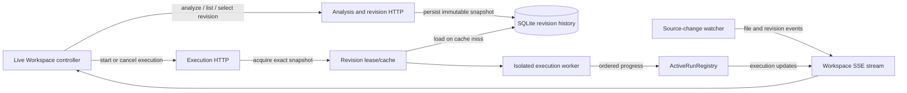

# Live Execution Workspace

## System Design

### SQLite becomes the backend authority for immutable Procedure revisions

The current backend computes a workspace-manifest revision and places its executable snapshot only in the bounded in-memory `RevisionStore`; the browser therefore sees only the latest analysis and loses history when the backend restarts (per the research findings). The new Workspace keeps the backend as the authority: each discovered analysis revision is recorded in SQLite, while execution reads the exact persisted snapshot selected by the operator. Deleting or changing source files does not delete historical rows.



### A revision row contains everything needed to inspect and rerun the snapshot

The durable record stores the canonical file, selected Procedure, content-addressed revision, canonical dependency-context graph, source context, discovered Procedures, CFG or diagnostics, and analysis timestamp. The complete loaded file map is retained so `/api/execute` remains safe after the source workspace changes or the selected file disappears.

```sql
CREATE TABLE analysis_revisions (
  file_path       TEXT NOT NULL,
  procedure_id    TEXT NOT NULL,
  revision        TEXT NOT NULL,
  analyzed_at     TEXT NOT NULL,
  source          TEXT NOT NULL,
  files_json      TEXT NOT NULL,
  procedures_json TEXT NOT NULL,
  cfg_json        TEXT,
  diagnostics_json TEXT NOT NULL,
  PRIMARY KEY (file_path, procedure_id, revision)
);
```

### History reads reuse the analysis contract while summaries stay small

The HTTP adapter exposes revision summaries separately from full snapshots. The existing analysis route gains an optional exact revision selector; omitting it analyzes the current workspace and records the resulting revision, while providing it loads the immutable historical snapshot.

```text
GET /api/analysis/revisions?file=...&procedureId=...
  response: { file, procedure, revisions: RevisionSummary[] }

GET /api/analysis?file=...&procedureId=...&revision=...
  response: AnalysisResponse
```

A historical diagnostic uses the same source-and-diagnostics response handling as a current diagnostic. An unavailable revision is distinct from a graph-blocking diagnostic so the browser can offer retry or fallback without silently changing the selected revision.

### One deep RevisionHistory interface separates analysis and execution from SQLite

Analysis, history HTTP, and execution depend on a small `RevisionHistory` interface. The SQLite adapter owns schema, JSON serialization, idempotent writes, and retention; the in-memory adapter remains the test double. Neither the browser nor route handlers reconstruct snapshots or access database rows directly.

```text
RevisionHistory
  list({ file, procedureId }) -> RevisionSummary[]
  load({ file, procedureId, revision }) -> AnalysisSnapshot | unavailable
  acquire({ file, procedureId, revision }) -> RevisionLease | unavailable
  save(snapshot: AnalysisSnapshot) -> void
```

### Stable Procedure IDs identify every analysis and execution scope

All analysis-history, historical-analysis, and execution requests use the discovered `ProcedureResource.id`; display names remain labels only. This removes the current name-based ambiguity for duplicate declarations and gives SQLite rows, active runs, browser selection, and HTTP requests one shared identity.

```text
POST /api/execute
  request:  { file, procedureId, revision }
  response: 202 { executionId }
```

### Import visibility is a projection of one canonical graph

Every Analysis revision stores the dependency-context graph once. The browser's `Imports` control filters contextual import nodes and their edges without creating another revision or requesting another analysis. Import visibility is persisted with browser-local Workspace preferences, but it is not part of revision identity and cannot affect execution.

### The repository owns one ignored local history database

The runtime database lives at `<repository>/.runtime-visualizer/revisions.sqlite`, and `.runtime-visualizer/` is gitignored. This keeps local tool state easy to locate and configure without committing generated history. The configured source workspace remains a separate observed path.

### Retention preserves recent history and every active execution snapshot

For each Procedure, history retains every revision created during the last 30 days and always retains its newest 20 revisions. Pruning runs on startup and after a new revision commits. A revision leased by an active execution is never deleted; it becomes eligible only after the run terminates. Expired history is permanently unavailable rather than silently regenerated from different source inputs.

### Application lifetime owns one workspace history and execution leases remain independent

`createApp` will open the repository-local SQLite history store for the configured files workspace and close it with Fastify. Analysis writes immutable rows; history reads enumerate retained rows for a file and Procedure; the existing in-memory store becomes a short-lived lease/cache over persisted snapshots so active workers retain their data without relying on source files. Each execution keeps its server execution ID, ordered event sequence, and revision pin independently.

### Startup builds a baseline without delaying the Workspace

After Fastify begins serving requests, the revision-build queue schedules every existing source file once. The Workspace can immediately request and persist its selected Procedure through the ordinary analysis route; background work fills the remaining Procedure history and publishes `revision-ready` events as rows commit. Idempotent content hashes make overlap between foreground analysis and baseline work harmless.

```text
backend ready
  ├── serve Workspace requests immediately
  └── enqueue existing source files
        build dependency-aware Procedure revisions in background
```

### File-change events trigger debounced revision building

The existing `SourceChangeWatcher` will publish source changes to a backend revision builder in addition to its SSE subscribers. A bounded in-process queue owns debounce, duplicate coalescing, and retry of failed indexing work; it never delays SSE delivery. For additions and modifications, the builder analyzes every Procedure whose dependency closure includes the changed path. For deletion, it retains the deleted file's history and rebuilds surviving dependents so missing-dependency diagnostics become revisions. New snapshots are inserted idempotently, and diagnostic revisions remain non-runnable. The browser still receives the original SSE event so it can update its newer-revision badge without making selection implicit.

```text
SourceChangeWatcher
  publish(change) ──┬──> SSE subscribers immediately
                    └──> RevisionBuildQueue.enqueue(change)
                           debounce and coalesce by path
                           retry failed work in-process
                           RevisionBuilder.buildAffected(change)
                             RevisionHistory.save(snapshot)
```

On backend restart, the queue is intentionally empty; the next source event rebuilds relevant history, while already persisted snapshots remain readable and runnable.

### Revision-ready events update badges without selecting newer content

After `RevisionHistory.save` commits a new row, the revision builder publishes a second SSE event for that exact Procedure revision. The browser refreshes only the relevant revision summaries, computes the count newer than its selected revision, and leaves its source and graph unchanged. This event follows persistence, so it cannot advertise a revision that history retrieval cannot load.

```text
GET /api/events
  event: revision-ready
  data: { file, procedureId, revision }
```

### Active runs are workspace-wide server state, recoverable from any browser

Decided by: pi gpt-5.6-sol:xhigh

The execution module keeps every running worker in an `ActiveRunRegistry`, keyed by server execution ID. SSE is the only browser progress channel: `POST /api/execute` returns `202 { executionId }`, then the registry broadcasts ordered node and terminal updates to every connected browser. Its state includes the pinned file, Procedure, revision, start time, status, and current node. This registry—not one browser controller—authoritatively powers the Workspace Active Runs rail. A newly opened or reloaded browser receives its current snapshot, then incremental updates, so it can View or cancel a run created from another browser without affecting the run.

```text
GET /api/events (SSE)
  event: active-executions
  data: ActiveExecution[]             # sent when a browser connects

  event: execution-update
  data: ExecutionUpdate               # node/status changes

GET /api/executions
  response: { executions: ActiveExecution[] } # explicit reload fallback
```

The active list orders records newest first and removes a run when it reaches any terminal outcome. Browser-local state may retain terminal details only for its notifications; it does not determine whether a run is active.

### Cancellation targets the server-owned execution, not the browser stream

`DELETE /api/executions/:executionId` asks the registry to stop the matching worker, publishes one terminal `Cancelled` update through SSE, and removes the record from Active Runs immediately. A lost browser connection only detaches that browser—it does not cancel the server execution.

```text
DELETE /api/executions/:executionId
  response: 202 Accepted

SSE terminal update
  { event: "execution-update", data: { executionId, status: "Cancelled" } }
```

An unknown or already terminal execution returns `404` without affecting any other run.

### Backend restarts fail active runs for this release

Active workers are intentionally process-bound. A backend restart produces a terminal `Failed` outcome for every active run; persisted analysis revisions remain available for inspection and a new execution. This is a known robustness limit, recorded for future work in `ROBUSTNESS.md`, rather than an attempt to resume unsafe in-process execution state.

### Browser-local selection restores a personal Workspace scope

The browser persists only the last selected file, Procedure, revision, and graph-import setting in local storage. On startup it validates that exact saved selection against revision history before rendering it. If a member is unavailable, the controller falls back in order to the first available file, Procedure, and revision; it never substitutes a newer revision for an otherwise valid selection. The backend does not model Operator identity or persist browser layout preferences.

```text
local storage
  { file, procedureId, revision, importsVisible }
        │ validate against RevisionHistory
        ▼
selected immutable Workspace scope
  or deterministic first-available fallback
```

## Program Design

### The analysis module owns the complete revision lifecycle

Revision persistence, retention, startup/file-change building, and history routes move behind the existing analysis module. Execution loses its private in-memory revision store and consumes the analysis-owned `RevisionHistory` interface instead.

```diff
 backend/src/modules
 ├── analysis
 │   ├── http.ts                         # current + historical analysis routes
+│   ├── revisionHistory.ts              # small interface and snapshot types
+│   ├── useCases/buildRevisionHistory/
+│   │   ├── buildAffectedRevisions.ts
+│   │   └── createRevisionBuildQueue.ts
+│   └── infra/
+│       ├── sqliteRevisionHistory.ts
+│       └── inMemoryRevisionHistory.ts
 └── execution
-    └── infra/revision-store.ts
```

```ts
interface RevisionHistory {
  list(scope: ProcedureScope): Promise<readonly RevisionSummary[]>;
  load(key: RevisionKey): Promise<AnalysisSnapshot | undefined>;
  acquire(key: RevisionKey): Promise<RevisionLease | undefined>;
  save(snapshot: AnalysisSnapshot): Promise<"inserted" | "existing">;
}

type RevisionLease = {
  readonly snapshot: AnalysisSnapshot;
  release(): void;
};
```

The SQLite and in-memory adapters are the two real implementations at this seam. Callers receive domain snapshots and summaries; SQL rows, JSON encoding, transactions, retention queries, and leases remain implementation details.

### Each coalesced change batch rebuilds one dependency map

Decided by: pi gpt-5.6-sol:high

The revision builder reads the workspace once per debounce batch, resolves one dependency map, then derives every source root whose transitive closure intersects an added, modified, or deleted path. It discovers and analyzes each Procedure under those affected roots. No long-lived dependency cache can drift from filesystem truth.

```text
buildAffectedRevisions(changedPaths)
  workspace = read supported source files once
  dependencies = resolve dependency map(workspace)
  affectedRoots = roots whose closure intersects changedPaths

  for each root in affectedRoots
    for each discoverProcedures(root.source)
      analyze canonical dependency-context graph
      RevisionHistory.save(snapshot)
```

A startup baseline uses the same workflow with every current source file marked changed, avoiding a second analysis path.

### Revision building runs in one dedicated worker thread

Decided by: pi gpt-5.6-sol:high

The queue sends coalesced path batches to one long-lived analysis worker. The worker reads the workspace, builds the dependency map, discovers Procedures, and returns serializable snapshots. The Fastify thread validates those snapshots, commits them through `RevisionHistory`, and publishes `revision-ready`. This keeps synchronous TypeScript analysis off HTTP and SSE delivery while bounding CPU and memory use to one background build at a time.

```diff
 backend/src/modules/analysis
 ├── useCases/buildRevisionHistory/
 │   ├── buildAffectedRevisions.ts
 │   └── createRevisionBuildQueue.ts
 └── infra/
+    ├── revisionBuilderWorker.ts
+    ├── revisionBuilderWorkerClient.ts
     ├── sqliteRevisionHistory.ts
     └── inMemoryRevisionHistory.ts
```

Worker failure rejects only its current item. The scheduler retries that item and replaces the worker before accepting more work; Fastify and active execution workers remain alive.

### All saved-source analysis shares one prioritized worker path

Decided by: pi gpt-5.6-sol:high

The analysis HTTP route no longer invokes TypeScript analysis on the Fastify thread. One scheduler sends interactive scope requests at high priority, file-change work at normal priority, and startup-baseline work at low priority. Background batches are split into Procedure-sized items so a newly queued interactive request runs after the current item rather than after an entire workspace build. Equivalent queued scope requests share one promise.

```ts
type AnalysisPriority = "interactive" | "change" | "baseline";

interface SavedAnalysisScheduler {
  analyze(scope: ProcedureScope, priority: AnalysisPriority): Promise<AnalysisSnapshot>;
  enqueueAffected(paths: readonly string[], priority: "change" | "baseline"): void;
}
```

```text
GET current analysis
  SavedAnalysisScheduler.analyze(scope, interactive)
    worker analyzes canonical snapshot
    RevisionHistory.save(snapshot)
    return snapshot
```

Historical revision loads bypass the worker and read `RevisionHistory` directly.

### Background infrastructure failures retry twice, then become visible

Decided by: pi gpt-5.6-sol:high

A failed worker or persistence operation retries after 500 ms and 2 seconds. After the third failed attempt, the scheduler stops that item, logs its affected paths and cause, and publishes `revision-build-failed`; the Workspace shows a concise notification with `Retry`, which re-enqueues the paths at change priority. A later file event also supersedes the failed item. Graph diagnostics are successful Analysis revisions and never enter this retry path.

```text
build item
  attempt 1
  failure -> wait 500 ms
  attempt 2
  failure -> wait 2 s
  attempt 3
  failure -> publish revision-build-failed

Retry -> enqueueAffected(paths, "change")
```

### The SQLite adapter uses Bun's built-in database driver

`SqliteRevisionHistory` owns one `bun:sqlite` `Database`, creates schema and indexes at startup, enables WAL mode, validates decoded JSON through shared contracts, and performs save-plus-prune in one transaction. There is no ORM or additional database dependency.

```ts
import { Database } from "bun:sqlite";

function createSqliteRevisionHistory(
  databasePath: string,
  clock: Clock,
): RevisionHistory;
```

The in-memory adapter implements the same interface for use-case and incoming-adapter tests; SQLite integration tests use a temporary on-disk database so restart and transaction behavior remain covered.

### The approved mock becomes production modules and then disappears

Decided by: pi gpt-5.6-sol:high

The generated component remains only a visual reference while its graph-first structure is rebuilt from live controller state. Production modules receive narrow state slices and dispatch controller intents; they do not own duplicate server or selection state. After parity is verified, the generated component and obsolete prototype entry paths are deleted rather than retained as alternate implementations.

```diff
-browser/src/components/generated/LiveProcedureWorkspace.tsx
 browser/src/pages/liveWorkspace/
 ├── liveWorkspace.page.tsx             # composition root
+├── components/workspaceHeader/WorkspaceHeader.tsx
+├── components/contextRail/ContextRail.tsx
+├── components/contextRail/ScopeNavigation.tsx
+├── components/contextRail/ActiveRuns.tsx
+├── components/procedureWorkspace/ProcedureWorkspace.tsx
+├── components/controlFlowGraph/GraphPane.tsx
+├── components/source/SourcePane.tsx
+└── components/notifications/WorkspaceNotifications.tsx
```

```tsx
<LiveWorkspacePage>
  <WorkspaceHeader connection={state.connection} />
  <ContextRail activeTab={state.contextTab}>
    <ScopeNavigation /> | <ActiveRuns />
  </ContextRail>
  <ProcedureWorkspace scope={state.selectedScope}>
    <GraphPane />
    <SourcePane />
  </ProcedureWorkspace>
  <WorkspaceNotifications />
</LiveWorkspacePage>
```

### React Flow and ELK provide an interactive control-flow canvas

Decided by: pi gpt-5.6-sol:high

`GraphPane` converts the selected canonical CFG into React Flow nodes and edges, while ELK computes a layered layout that tolerates branches, joins, and cycles. Graph nodes remain React-owned so neutral focus, multiple labelled execution markers, keyboard selection, and source-range metadata are explicit props. `Fit graph` invokes the React Flow viewport interface; import visibility filters the CFG before layout.

```text
GraphPane
  selectVisibleGraph(cfg, importsVisible)
  useControlFlowLayout(visibleGraph) -> positioned nodes + edges
  ReactFlow
    ControlFlowNode
      FocusRing
      ExecutionMarker[]
    ControlFlowEdge[]
    FitGraphControl
```

```diff
 browser/package.json
+  @xyflow/react
+  elkjs

 browser/src/pages/liveWorkspace/components/controlFlowGraph/
-  ControlFlowGraph.tsx
+  GraphPane.tsx
+  ControlFlowNode.tsx
+  controlFlowLayout.ts
+  selectVisibleGraph.ts
```

Layout results are keyed by revision and import visibility so execution-node updates move markers without recomputing positions.

### One node ID synchronizes graph, source, and failure focus

Decided by: pi gpt-5.6-sol:high

The controller owns one optional `FocusTarget`; neither pane owns a second selection. Graph selection dispatches its node ID. Source selection resolves to the smallest executable CFG node containing that source position, then dispatches the same ID. Ordinary scope changes clear focus. Failure navigation atomically selects the run's pinned revision and defers its failed node focus until that snapshot loads.

```ts
type FocusTarget = {
  readonly scope: RevisionKey;
  readonly nodeId: string;
  readonly origin: "graph" | "source" | "failure";
};

resolveSourcePosition(
  cfg: ControlFlowGraph,
  position: SourcePosition,
): string | undefined;
```

A failed `execution-update` carries the error summary and last current node as `failedNodeId`. `WorkspaceNotifications.viewFailure(executionId)` dispatches one intent; the reducer produces the scope-load effect and retains the pending focus target until the matching analysis arrives.

### A purpose-built source renderer exposes executable ranges without an editor

Decided by: pi gpt-5.6-sol:high

`SourcePane` renders the immutable snapshot as numbered text lines and derives selectable executable ranges from CFG node locations. React text rendering preserves and escapes source without injecting HTML. Selecting a position resolves through the shared range index; non-executable text has no selection behavior. The focused range uses a neutral style distinct from live execution markers and diagnostics.

```text
SourcePane
  createSourceRangeIndex(cfg.nodes)
  split source without normalizing content
  SourceLine[]
    SourceSegment
      nodeId? -> controller.focusSourcePosition(position)
      focused? -> neutral focus treatment
```

```ts
type SourceRangeIndex = {
  resolve(position: SourcePosition): NodeId | undefined;
  rangesForLine(line: number): readonly NodeSourceRange[];
};
```

No embedded editor, editable buffer, or second syntax model is introduced.

### A discriminated pane state preserves layout without invalid combinations

The reducer models analysis content as one state machine. A refresh enters `loading` with the previous snapshot retained but not rendered; success replaces it, while failure restores the previous snapshot and exposes a local retry error. Each load carries a request ID, so late responses for an abandoned scope cannot replace the current selection.

```ts
type AnalysisPaneState =
  | { readonly status: "empty" }
  | { readonly status: "loading"; readonly requestId: string; readonly previous?: AnalysisSnapshot }
  | { readonly status: "ready"; readonly value: AnalysisSnapshot }
  | { readonly status: "failed"; readonly previous?: AnalysisSnapshot; readonly error: string };
```

```text
select scope
  -> loading(previous)       pane dimensions remain; content hidden
  -> ready(snapshot)         render selected revision
  -> failed(previous, error) reveal last valid content + local Retry
```

Top-level connection state remains separate because SSE reconnection does not invalidate a loaded Analysis revision or disable its execution.

### Cancellation hides the row immediately and rolls back deterministically

Decided by: pi gpt-5.6-sol:high

The first click arms only that active-run row. The second dispatches `cancelRequested`, records the run in `pendingCancellations`, hides it from the rail, emits the requested notification, and starts the DELETE effect. A `Cancelled` SSE update clears pending state. A transport/server failure restores the run and emits an error; a `404` instead triggers active-run resynchronization because the run may already have terminated.

```ts
type CancellationState = {
  readonly armedExecutionId: string | null;
  readonly pendingById: Readonly<Record<string, true>>;
};
```

```text
armCancel(id)
  -> armedExecutionId = id

confirmCancel(id)
  -> pendingById[id] = true
  -> CancelExecution effect
     accepted/SSE terminal -> clear pending
     request error         -> restore + notify
     404                   -> reload active snapshot
```

Arming another row replaces the previous safeguard; no modal or global confirmation state exists.

### Workspace preferences isolate local storage behind a small seam

Decided by: pi gpt-5.6-sol:high

The controller receives `WorkspacePreferences`; it never reads browser globals. The production adapter validates one saved scope from local storage, and the in-memory adapter supports startup, unavailable-selection fallback, and persistence tests. Invalid or obsolete data is discarded rather than migrated.

```ts
interface WorkspacePreferences {
  load(): SavedWorkspaceScope | undefined;
  save(scope: SavedWorkspaceScope): void;
}

type SavedWorkspaceScope = {
  readonly file: string;
  readonly procedureId: string;
  readonly revision: string;
  readonly importsVisible: boolean;
};
```

Persistence occurs only after a complete scope becomes selected; transient loading and focus state are not stored.

### One controller and a pure reducer keep Workspace transitions atomic

Decided by: pi gpt-5.6-sol:high

The external `WorkspaceController` remains the single React-facing module. Its four-method interface exposes state, subscription, typed intent dispatch, and disposal; adding an interaction extends the intent union rather than adding another controller method. Its implementation delegates all state transitions to a pure reducer and interprets returned effect descriptions through injected gateways. Scope, revision, active-run, connection, pane-loading, focus, and notification state therefore change atomically without cross-store synchronization.

```diff
 browser/src/pages/liveWorkspace/useCases
 ├── createLiveWorkspaceController.ts   # dispatch + effect interpreter
+├── liveWorkspace.reducer.ts           # pure state transitions
+├── liveWorkspace.effects.ts           # effect descriptions and runner
 ├── liveWorkspace.ports.ts
 └── liveWorkspace.types.ts
```

#### Typed intents keep the controller interface fixed

Decided by: pi gpt-5.6-sol:high

```ts
interface WorkspaceController {
  getState(): LiveWorkspaceState;
  subscribe(listener: WorkspaceListener): Unsubscribe;
  dispatch(intent: WorkspaceIntent): void;
  dispose(): void;
}

type Transition = {
  readonly state: LiveWorkspaceState;
  readonly effects: readonly WorkspaceEffect[];
};

function reduceWorkspace(
  state: LiveWorkspaceState,
  event: WorkspaceEvent,
): Transition;
```

Reducer tests assert state and requested effects. Controller tests cross the public `WorkspaceController` interface with gateway adapters and verify cancellation, stale-response suppression, retry, and disposal behavior.

### ExecutionManager hides worker and active-run lifecycle

Decided by: pi gpt-5.6-sol:high

HTTP routes and the Workspace event stream use one deep execution module. `ExecutionManager` owns revision leases, worker creation, monotonic per-run event ordering, current-node updates, cancellation, terminal cleanup, and subscriber publication; callers never coordinate a runner and registry themselves.

```ts
interface ExecutionManager {
  start(input: StartExecution): Promise<ExecutionId>;
  listActive(): readonly ActiveExecution[];
  cancel(id: ExecutionId): CancelResult;
  subscribe(listener: (event: ExecutionUpdate) => void): Unsubscribe;
}
```

```text
POST /api/execute
  ExecutionManager.start
    RevisionHistory.acquire
    start isolated worker
    register ActiveExecution
    publish Running

worker event
  ExecutionManager
    update only matching ActiveExecution
    publish ordered execution-update
    on terminal: release lease and remove ActiveExecution
```

### A configurable timeout fails runaway executions without coupling them to browsers

Decided by: pi gpt-5.6-sol:high

`ExecutionManager` passes a validated `executionTimeoutMs` to every worker; the default remains 30 seconds. Expiry terminates the worker and publishes one terminal `Failed` update with `Execution timed out`. Browser reload, disconnect, scope selection, and revision selection never touch this timer. Tests inject a short duration rather than waiting on wall-clock defaults.

```ts
type ExecutionManagerOptions = {
  readonly executionTimeoutMs: number; // default 30_000
};
```

```text
worker exceeds executionTimeoutMs
  -> terminate worker
  -> update { status: "Failed", error: "Execution timed out", failedNodeId }
  -> release revision lease
  -> publish terminal execution-update
```

### Server-assigned display numbers keep runs recognizable everywhere

Decided by: pi gpt-5.6-sol:high

`ExecutionManager` assigns a monotonically increasing process-local `displayNumber` when a run starts. The UUID remains machine identity; `#<displayNumber>` is the stable operator label used by graph markers, rail rows, and notifications in every browser. Ending or reordering runs never renumbers survivors. Numbers may restart after a backend restart because no active run survives it.

```ts
type ActiveExecution = {
  readonly executionId: string;
  readonly displayNumber: number;
  readonly scope: RevisionKey;
  readonly startedAt: string;
  readonly status: "Running";
  readonly currentNodeId: string | null;
};
```

Marker color is deterministically selected from `displayNumber` and always accompanied by the number, so color is never the sole identifier.

### One Workspace event stream carries execution progress

Decided by: pi gpt-5.6-sol:xhigh

The execution start adapter returns only the server execution ID. Node progress, terminal outcomes, source changes, revision availability, and active-run hydration all enter the controller through the Workspace SSE adapter, eliminating the previous origin-only NDJSON parser and duplicate progress paths.

### Monotonic event IDs replay outcomes across transient disconnects

Decided by: pi gpt-5.6-sol:high

A `WorkspaceEventHub` assigns every published event a process-local monotonic ID and retains the newest 10,000 events in memory. The SSE adapter writes the ID in each record. Reconnection supplies `Last-Event-ID`; the hub replays every later record in order, including terminal outcomes. If the requested ID predates the buffer, the hub emits `resync-required`, and the controller reloads files, selected revision summaries, and active runs through their snapshot interfaces.

```text
WorkspaceEventHub.publish(event)
  assign next event ID
  append to bounded replay buffer
  notify subscribers

WorkspaceEventHub.subscribe(lastEventId)
  replay retained events after lastEventId
  or emit resync-required
  then continue with live events
```

The sequence resets on backend restart, matching the accepted process-bound execution limit.

```diff
 packages/contracts/src
-├── execution.ts          # NDJSON stream records
-└── file-events.ts        # SSE records
+└── workspace-events.ts   # discriminated SSE event union

 browser/src/shared/api
-├── executionGateway.ts   # starts and parses NDJSON
-└── fileEventsGateway.ts
+├── executionGateway.ts   # start, list, cancel
+└── workspaceEventsGateway.ts
```

### Shared contracts make HTTP, persistence, and SSE decode the same shapes

`packages/contracts` owns Zod schemas and inferred types for revision keys and summaries, historical Analysis responses, execution commands, Active Executions, and Workspace events. `ProcedureCfg` gains the stable Procedure ID. The obsolete name-based request and NDJSON event shapes are removed rather than supported in parallel.

```diff
 packages/contracts/src/
 ├── analysis.ts
+├── revisions.ts
 ├── execution.ts
-├── file-events.ts
+├── workspace-events.ts
 └── index.ts
```

```ts
type ProcedureScope = {
  readonly file: string;
  readonly procedureId: string;
};

type RevisionKey = ProcedureScope & {
  readonly revision: string;
};

type RevisionSummary = RevisionKey & {
  readonly analyzedAt: string;
  readonly runnable: boolean;
  readonly diagnosticCount: number;
};

type WorkspaceEvent =
  | { readonly type: "source-change"; readonly change: SourceChange }
  | { readonly type: "revision-ready"; readonly revision: RevisionSummary }
  | { readonly type: "revision-build-failed"; readonly paths: readonly string[]; readonly error: string }
  | { readonly type: "active-executions"; readonly executions: readonly ActiveExecution[] }
  | { readonly type: "execution-update"; readonly update: ExecutionUpdate }
  | { readonly type: "resync-required" };
```

Every incoming adapter parses untrusted query, body, database JSON, worker message, and SSE payload data before passing it to a use case or reducer.

### Composition roots own lifetimes and inject every external effect

Fastify creates long-lived backend modules once and closes them in dependency order. React creates the controller and browser adapters once. Tests replace adapters at the same seams rather than reaching through them.

```text
createApp
  WorkspaceEventHub
  SqliteRevisionHistory
    -> SavedAnalysisScheduler
    -> ExecutionManager
  SourceChangeWatcher
    -> SavedAnalysisScheduler.enqueueAffected
    -> WorkspaceEventHub.publish
  HTTP adapters
    analysis -> scheduler + history
    execution -> ExecutionManager
    events -> WorkspaceEventHub

onClose
  stop SourceChangeWatcher
  stop SavedAnalysisScheduler and revision worker
  close ExecutionManager and execution workers
  close WorkspaceEventHub
  close SqliteRevisionHistory
```

```text
LiveWorkspacePage
  createAnalysisGateway
  createExecutionGateway
  createWorkspaceEventsGateway
  createLocalStorageWorkspacePreferences
  createRetryScheduler
    -> createLiveWorkspaceController
```

`AppOptions` accepts database path, clock, timeout, and module overrides for integration tests. Production resolves the database to `.runtime-visualizer/revisions.sqlite` from the repository settings location.

### State stores normalized identities and derives every visible projection

The reducer stores one selected `RevisionKey`, summaries by Procedure scope, Active Executions by ID, the pane state machine, focus, context tab, cancellation state, connection cursor, and notifications. It derives revision ordering, newer counts, visible graph markers, and newest-first rail rows through selectors rather than duplicating arrays in state.

```ts
type LiveWorkspaceState = {
  readonly files: readonly string[];
  readonly proceduresByFile: Readonly<Record<string, readonly ProcedureResource[]>>;
  readonly selectedScope: RevisionKey | null;
  readonly revisionsByScope: Readonly<Record<string, readonly RevisionSummary[]>>;
  readonly pane: AnalysisPaneState;
  readonly activeExecutionsById: Readonly<Record<string, ActiveExecution>>;
  readonly focus: FocusTarget | null;
  readonly contextTab: "scope" | "runs";
  readonly cancellation: CancellationState;
  readonly connection: WorkspaceConnectionState;
  readonly notifications: readonly WorkspaceNotification[];
};
```

Selecting a file chooses its first Procedure and newest retained revision only when the saved selection is unavailable. Selecting a Procedure chooses that Procedure's newest retained revision. A `revision-ready` update changes summaries and badge counts only. `View` on an Active Execution explicitly selects its exact `RevisionKey` without mutating the execution.

### The control-room layout follows existing tokens and responsive breakpoints

Production components use the color, type, spacing, status, graph-node, and breakpoint rules in `DESIGN.md`. The desktop grid reserves 268 px for the context rail and gives the graph a 1.6:1 share over source. Below `lg`, the rail becomes the existing off-canvas navigation pattern; below the pane breakpoint, graph and source stack without clipping. Active Runs scroll inside the rail and do not widen it for 30 or more rows.

```text
wide:    [268px Scope|Runs] [graph 1.6fr] [source 1fr]
medium:  [268px Scope|Runs] [graph/source workspace]
small:   [off-canvas rail]  [graph]
                            [source]
```

Loading masks only pane content while retaining these dimensions. Diagnostics occupy the graph pane for a non-runnable revision; the source pane remains available.

### Test assertions cover seams and complete operator flows

```text
integration: SQLite revision history
  boundary: RevisionHistory interface -> SQLite file
  asserts: survives reopen; returns newest-first summaries; preserves newest 20 and last 30 days; never prunes a leased revision

integration: prioritized saved analysis
  boundary: scheduler -> analysis worker -> RevisionHistory
  asserts: deduplicates equivalent requests; interactive work precedes queued background items; additions, modifications, and deletions rebuild the dependency-affected Procedures

unit: ExecutionManager
  boundary: ExecutionManager interface with worker and RevisionHistory adapters
  asserts: assigns stable display numbers; orders node updates per execution; keeps concurrent executions independent; releases leases exactly once on success, failure, timeout, and cancellation

integration: Workspace event replay
  boundary: event publishers -> WorkspaceEventHub -> SSE adapter
  asserts: hydrates Active Executions; replays after Last-Event-ID; emits resync-required for an expired cursor; never loses a terminal outcome within the buffer

acceptance-unit: Workspace reducer and controller
  boundary: WorkspaceController with in-memory gateways and preferences
  asserts: restores or deterministically falls back from saved scope; never auto-selects revision-ready content; suppresses stale loads; rolls cancellation back on failure; preserves executions across scope changes

component: graph and source synchronization
  boundary: GraphPane and SourcePane props/intents
  asserts: one neutral node focus appears in both panes; every matching Active Execution has a stable labelled marker; import filtering does not mutate revision identity or recompute layout on progress

acceptance-E2E: durable live Workspace
  boundary: browser -> Fastify -> SQLite/analysis/execution workers
  asserts: selects and runs historical revisions after source deletion; recovers and cancels active execution after reload or from another browser; displays revision badges without replacing the selected graph

acceptance-E2E: loading, diagnostics, and terminal outcomes
  boundary: operator-visible Workspace
  asserts: retains pane dimensions during refresh; restores prior content on refresh failure; disables only a diagnostic revision; focuses failed source; removes markers for success, failure, timeout, and cancellation
```

### Low-confidence decisions need implementation evidence

- **10,000-event replay buffer** — no measured execution-event volume exists yet; load tests should confirm the memory/catch-up tradeoff.
- **ELK layout performance** — graph size distribution is unknown; component tests should measure layout latency before considering a worker or cached persisted positions.
- **Single analysis worker throughput** — it protects responsiveness, but a large workspace baseline may complete slowly; instrument queue depth and item duration before adding parallelism.

## Patterns to Follow

- Zod wire contracts in `packages/contracts/src/analysis.ts` — parse external data once and infer TypeScript types from the schema.
- Application-lifetime wiring in `backend/src/shared/infra/http/app.ts` — create shared modules once, inject them into Fastify adapters, and close owned resources in `onClose`.
- Isolated worker lifecycle in `backend/src/modules/execution/useCases/executeProcedure/runner.ts` — bound resources, normalize worker outcomes, and guarantee cleanup.
- Controller ports in `browser/src/pages/liveWorkspace/useCases/liveWorkspace.ports.ts` — React consumes one controller while tests inject adapters.
- Control-room tokens and responsive rules in `DESIGN.md` — production UI ports the approved visual language rather than preserving generated mock state.

## What We're Not Doing

- Resuming an Execution across backend process restarts; the future direction is recorded in `ROBUSTNESS.md`.
- Building persistent execution history or a dedicated run-detail surface.
- Adding editable source, an embedded code editor, or source-file mutation.
- Supporting obsolete name-based Procedure requests, NDJSON progress streams, or generated prototype routes.
- Sharing browser preferences through backend Operator accounts.
