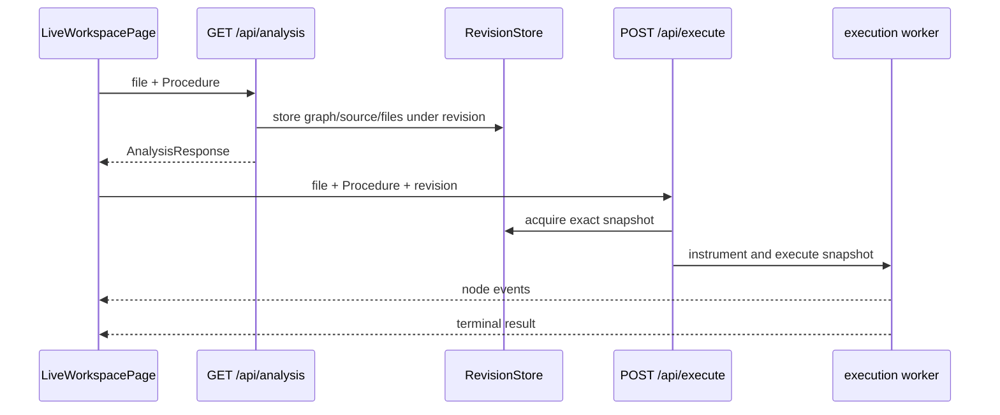

# Research: Map the recovered design and current product surface

**Date**: 2026-08-24T17:55:21Z  
**Git Commit**: 8a950f2f0bb687da59fd100775b40e188676c875  
**Branch**: main  
**Repository**: TiagoJacinto/runtime-visualizer

## Research Question

1. Where is the recovered `fe597920` visual direction represented, and what visual language does it establish?
2. What frontend screens, flows, and components make up the current product surface?
3. How are execution, control-flow graphs, source, diagnostics, backend contracts, revisions, and tests represented today?

## Research Methodology (verbatim)

This document will remain objective and factual. It does not contain any recommendations or implementation suggestions.
Open questions will not ask Why things haven't been built or what should be built in the future.

There is no "implementation" section - that is intentional.

## Summary

The recovered commit `fe597920` contains the product’s visual direction in `DESIGN.md`, `PRODUCT.md`, `.impeccable/design.json`, and the generated `LiveProcedureWorkspace` component. Its visual language is a compact “Live Control Room”: green-black layered surfaces, scarce emerald live-state color, Inter for interface text, IBM Plex Mono for code and runtime values, hairline borders, local shadows, rounded controls, a three-region responsive shell, graph-centered work, and a contextual run panel (`DESIGN.md:107-115`, `DESIGN.md:149-189`).

The current production browser surface is a single `LiveWorkspacePage`, mounted directly by `App` with no route switch (`browser/src/App.tsx:1-23`). It loads backend-owned files, selected Procedures, source, CFG analysis, diagnostics, revisions, executions, and file-change events through a framework-independent workspace controller (`browser/src/pages/liveWorkspace/liveWorkspace.page.tsx:1-173`, `browser/src/pages/liveWorkspace/useCases/createLiveWorkspaceController.ts:1-409`). The current rendered shell is functional but materially simpler than the recovered direction: a file/procedure navigation column, source panel, diagnostics panel, generic graph-node list, Run button, and execution inspector (`browser/src/pages/liveWorkspace/liveWorkspace.page.tsx:42-165`, `browser/src/pages/liveWorkspace/components/controlFlowGraph/ControlFlowGraph.tsx:1-27`).

The recovered generated component remains in the repository but is not mounted by `App`; it is a static design surface with fixed source, graph, runs, diagnostics, and revisions (`browser/src/components/generated/LiveProcedureWorkspace.tsx:34-87`, `:169-218`). The backend is the current source of truth for real product data: Fastify exposes files, analysis, CFG, execution, and SSE file events (`backend/src/shared/infra/http/app.ts:71-106`). The contracts bind a selected Procedure and its SHA-256-derived revision to a JSON-serializable graph, while execution returns ordered node events followed by a terminal result (`packages/contracts/src/analysis.ts:1-72`, `packages/contracts/src/execution.ts:1-25`).

## Detailed Findings

### 1. The recovered direction is a documented control-room system, not a route or component library

`fe597920` records the visual direction in `DESIGN.md` and supporting design metadata. The north star is a calm operational control room with a green-black canvas, layered graphite-green panels, emerald execution signals, compact density, and a graph as the visual focus (`DESIGN.md:107-115`).

The palette assigns emerald to primary action, active graph state, and connected state; amber to deferred refresh and filesystem changes; sky to running status; rose to failures; and tonal green surfaces to canvas, panels, sidebar, diagnostics, and graph nodes (`DESIGN.md:117-149`). The signal-scarcity rule explicitly reserves emerald for what is live now (`DESIGN.md:149`).

Typography has two voices: Inter carries actions and interpretation, while IBM Plex Mono carries source, paths, revisions, nodes, timestamps, and other machine-facing values (`DESIGN.md:151-168`). The layout is a 268px navigation rail, flexible central workspace, and 250px run inspector on wide screens, with a 56px top bar and a graph area of at least 430px (`DESIGN.md:170-174`).

The component vocabulary is documented as compact rounded buttons and inputs, flat tonal panels with hairline borders, graph nodes with local lift, accessible numbered run markers, status chips with text and icons, and an off-canvas navigation rail on narrow screens (`DESIGN.md:187-229`). The recovered generated component demonstrates those patterns directly: graph nodes use a 250px maximum width, rounded borders, dark graph surfaces, emerald active styling, and numbered markers (`browser/src/components/generated/LiveProcedureWorkspace.tsx:103-167`).

The repository does not contain a general component-library package for this system. The browser uses React, Vite, Tailwind CSS, Tailwind animation utilities, Lucide icons, and Framer Motion as package/configuration dependencies (`browser/package.json:1-56`, `browser/src/index.css:1-4`, `browser/src/main.tsx:1-7`). `index.css` imports Inter and IBM Plex Mono and also defines generic light/dark OKLCH tokens (`browser/src/index.css:1-129`), while production workspace classes use direct Tailwind utilities and explicit dark-green values (`browser/src/pages/liveWorkspace/liveWorkspace.page.tsx:42-165`).

#### Testing patterns

The recovered visual surface is documented by source and design records rather than a visual snapshot suite. Browser acceptance scenarios test user-visible graph, diagnostics, imports, and execution semantics through Playwright-BDD bindings (`browser/tests/acceptance/e2e/`, `features/*.feature`).

### 2. The current product has one live workspace flow

`App` mounts only `LiveWorkspacePage`; there is no router or alternate screen (`browser/src/App.tsx:1-23`). On startup the page creates the controller and subscribes to its state (`browser/src/pages/liveWorkspace/liveWorkspace.page.tsx:15-39`). The controller lists files, selects the first available file, analyzes it, and subscribes to file events (`browser/src/pages/liveWorkspace/useCases/createLiveWorkspaceController.ts:290-404`).

The current component tree is:

```text
<App>
└── <LiveWorkspacePage>
    ├── navigation
    │   ├── File <select>
    │   └── Procedure <select>
    └── work area
        ├── workspace header + revision
        ├── Source <pre>
        ├── Diagnostics
        ├── ControlFlowGraph
        ├── Run Procedure <button>
        └── RunInspector
```

The user flow is file selection → Procedure selection → source/diagnostic/graph display → Run Procedure → streamed execution markers and terminal status. File changes are applied immediately when no matching execution is active; otherwise the selected revision stays visible and the newer revision is reported as `Update queued` (`browser/src/pages/liveWorkspace/useCases/createLiveWorkspaceController.ts:185-220`, `:240-286`). Reconnection disables selection and running, retries with bounded exponential backoff, and refreshes after reconnection (`browser/src/pages/liveWorkspace/useCases/createLiveWorkspaceController.ts:291-365`).

The page exposes loading, empty-folder, reconnecting, queued-update, deleted-file, backend-error, diagnostics, unavailable-graph, and ready states (`browser/src/pages/liveWorkspace/liveWorkspace.page.tsx:42-165`). The current graph component renders all returned nodes as a flex-wrap list and reports only an edge count; it does not draw the returned edges (`browser/src/pages/liveWorkspace/components/controlFlowGraph/ControlFlowGraph.tsx:10-27`).

The recovered generated component represents a richer visual composition but remains static and unmounted. It contains a top bar, responsive navigation, source/graph tabs, fixed graph connectors, run list, contextual run inspector, diagnostics drawer, and fixed deferred-refresh copy (`browser/src/components/generated/LiveProcedureWorkspace.tsx:218-480`, `:505-593`, `:598-739`). Its controls mutate only local state, and its source, graph, diagnostics, and initial runs are module-level constants (`browser/src/components/generated/LiveProcedureWorkspace.tsx:34-87`, `:169-217`).

#### Testing patterns

The feature suite describes the user-visible flow for live workspace loading and running saved Procedures (`features/live-workspace.feature:1-31`). Browser acceptance tests exercise accessible file/procedure controls, graph visibility, diagnostics, execution highlighting, and queued updates (`browser/tests/acceptance/e2e/`). Controller behavior is independently testable through injected gateway ports (`browser/src/pages/liveWorkspace/useCases/liveWorkspace.ports.ts:1-23`).

### 3. The backend contract is a revision-consistent analysis-to-execution pipeline

`createApp` creates one `RevisionStore` and one source-change watcher, then registers analysis, CFG, execution, file, source, and event routes (`backend/src/shared/infra/http/app.ts:71-106`). The browser gateways call the following live endpoints:

| Endpoint | Request | Current response |
|---|---|---|
| `GET /api/files` | none | sorted file paths, filtered in the browser to `.ts`/`.tsx` |
| `GET /api/analysis?file=&name=` | selected file and optional function name | source, Procedure catalog, revision, CFG, diagnostics |
| `POST /api/execute` | `{ file, name?, revision }` | `X-Execution-Id` plus NDJSON node/result events |
| `GET /api/events` | none | SSE file-change events |

The analysis route accepts `showImports` as a query value as well as `file` and `name` (`backend/src/modules/analysis/http.ts:5-48`). The analysis snapshot contains the selected file, selected Procedure, revision, source, all discovered Procedures, CFG, and structured diagnostics (`backend/src/modules/analysis/useCases/analyseSavedProcedure/analyse-saved-procedure.ts:8-31`).

A Procedure is either the synthetic top-level Procedure or a named function declaration discovered in source order (`backend/src/modules/source/useCases/discoverProcedures/discover-procedures.ts:8-50`). A CFG is JSON data containing optional file metadata, function CFGs, and selected Procedure CFGs. Nodes carry IDs, kinds, labels, optional source locations, and optional source text; edges carry source/target IDs and optional kind/label (`backend/src/modules/cfg/types.ts:16-131`, `packages/contracts/src/analysis.ts:1-52`). Diagnostics can identify a Procedure, dependency, reason, message, and source location (`packages/contracts/src/analysis.ts:54-72`).

Successful analysis stores an immutable snapshot keyed by file, Procedure name, and revision. The snapshot includes the selected source, all project files used for analysis, the selected Procedure graph, and function name (`backend/src/modules/analysis/useCases/analyseSavedProcedure/analyse-saved-procedure.ts:79-137`, `backend/src/modules/execution/infra/revision-store.ts:3-89`). The revision is a SHA-256 hash of compiler options, dependency file contents, and `showImports` (`backend/src/modules/analysis/useCases/analyseSavedProcedure/analyse-saved-procedure.ts:141-163`). Execution acquires that snapshot, runs it in a worker, emits reached node IDs, and releases the snapshot after a terminal result (`backend/src/modules/execution/useCases/executeProcedure/execute.ts:77-175`, `backend/src/modules/execution/useCases/executeProcedure/execution-worker.ts:30-74`).



#### Testing patterns

Backend typical unit tests exercise CFG analysis directly; integration tests create temporary source folders and inject requests into a real Fastify app; source-change tests use real streams and filesystem mutations; acceptance tests bind Gherkin feature files with Vitest-Cucumber (`backend/tests/typical/`, `backend/tests/acceptance/unit/`, `backend/tests/typical/integration/source-change.integration.ts:1-149`).

### 4. Current behavior preserves graph semantics and explicit failure states

The CFG domain represents entry, exit, imports, statements, branches, switch/case/default, returns, throws, breaks, continues, try/catch/finally, and source locations (`backend/src/modules/cfg/types.ts:16-131`). Imports are optional contextual nodes and are not expanded into local execution flow (`backend/src/modules/analysis/http.ts:9-19`, `features/show-control-flow-imports.feature:7-22`).

Analysis diagnostics prevent a partial graph from being returned for selected-source or required-dependency failures. The feature scenarios cover syntax errors, type errors, unresolved dependencies, unsupported `with`, and unrelated errors that do not block the selected Procedure (`features/diagnose-control-flow-graph.feature:7-37`).

Execution events are `{ event: "node", data: { nodeId } }` followed by `{ event: "result", data: { status: "Succeeded" | "Failed", error? } }` (`packages/contracts/src/execution.ts:1-25`). The controller maps node events to `currentNodeId`; terminal events map to succeeded/failed and clear the node, while an ended or failed stream becomes interrupted (`browser/src/pages/liveWorkspace/useCases/createLiveWorkspaceController.ts:125-183`). The graph marks active nodes with numbered execution markers and `aria-current="step"` for the selected execution (`browser/src/pages/liveWorkspace/components/controlFlowGraph/ControlFlowGraph.tsx:10-24`).

#### Testing patterns

`features/visualize-control-flow.feature` specifies complete possible paths and node/edge semantics; `features/observe-execution.feature` specifies active-node progression and clearing after completion; `features/compose-multi-file-program.feature` specifies imported-program analysis; and `features/show-control-flow-imports.feature` specifies contextual import behavior. Backend integration tests cover CFG responses, diagnostics, revision-bound execution, concurrent runs, and source changes (`backend/tests/typical/integration/`).

## Code References

### Recovered direction

- `DESIGN.md:107-249` — visual language, tokens, typography, layout, components, and responsive rules.
- `PRODUCT.md:1-76` — product purpose, capabilities, constraints, and unestablished decisions.
- `.impeccable/design.json` — recovered design metadata.
- `browser/src/components/generated/LiveProcedureWorkspace.tsx:1-744` — static recovered workspace composition.

### Current browser

- `browser/src/App.tsx:1-23` — production root.
- `browser/src/pages/liveWorkspace/liveWorkspace.page.tsx:1-173` — rendered live workspace.
- `browser/src/pages/liveWorkspace/useCases/createLiveWorkspaceController.ts:1-409` — live state orchestration.
- `browser/src/shared/api/analysisGateway.ts:1-64` — analysis/files gateway.
- `browser/src/shared/api/executionGateway.ts:1-91` — execution NDJSON gateway.
- `browser/src/shared/api/fileEventsGateway.ts:1-52` — file-change SSE gateway.

### Current backend and contracts

- `backend/src/shared/infra/http/app.ts:1-119` — route composition and shared stores.
- `backend/src/modules/analysis/` — saved-source analysis and snapshot creation.
- `backend/src/modules/cfg/types.ts:1-134` — graph model.
- `backend/src/modules/execution/` — revision store, worker execution, and stream endpoint.
- `backend/src/modules/source/` — files, source, Procedures, and file events.
- `packages/contracts/src/analysis.ts:1-72` — analysis schema.
- `packages/contracts/src/execution.ts:1-25` — execution event schema.
- `packages/contracts/src/file-events.ts:1-10` — file event schema.

### Specifications and tests

- `features/*.feature` — graph, imports, diagnostics, multi-file composition, execution, and live workspace behavior.
- `backend/tests/typical/` and `backend/tests/acceptance/unit/` — backend unit, integration, and acceptance coverage.
- `browser/tests/acceptance/e2e/` — browser acceptance bindings and end-to-end scenarios.

## Architecture Documentation

The system has two current surfaces around one domain:

```text
Browser
  App
    LiveWorkspacePage
      WorkspaceController
        AnalysisGateway  -> GET /api/files, GET /api/analysis
        ExecutionGateway -> POST /api/execute (NDJSON)
        FileEventsGateway -> GET /api/events (SSE)
      Source / Diagnostics / ControlFlowGraph / RunInspector

Backend
  Fastify app
    Source module -> files, source, Procedures, file watcher
    Analysis/CFG -> TypeScript program, diagnostics, graph, RevisionStore
    Execution -> RevisionStore -> worker/VM -> node + result events
```

The current frontend renders a graph model but currently displays nodes as a list and reports edge count; the recovered visual direction depicts a connected graph field with a source-plus-graph workspace and contextual run inspector. Both surfaces use the same runtime vocabulary—Procedure, graph node, execution, revision, diagnostics, imports—but the recovered surface is static while the live surface is backend-connected (`browser/src/pages/liveWorkspace/liveWorkspace.page.tsx:42-165`, `browser/src/components/generated/LiveProcedureWorkspace.tsx:169-218`).

## Open Questions

None.
