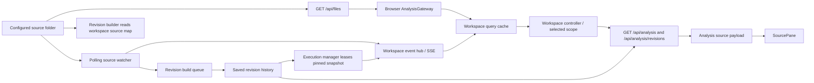

# Research: Browser file access, workspace state, and design system

**Date**: 2026-09-24T13:52:39Z  
**Git Commit**: `b50017004012f95196a6d2c11168c07903c25040`  
**Branch**: `worktree/remove-backend`  
**Repository**: `runtime-visualizer`

## Research Question

1. How does the browser application currently discover, select, and load source files, and which frontend modules consume the resulting file paths and contents?
2. How do the backend source-file listing and reading paths work today, including their supported file types, directory traversal rules, path-safety checks, and error behavior?
3. How do file changes propagate through the current system to workspace state, analysis/revision history, and the user interface?
4. How do analysis, execution, and revision-history flows obtain source files and their dependencies, and what contracts connect those flows to browser-side code?
5. What browser file APIs or related libraries are currently used, if any, and what permissions, persistence, browser-support, and directory/file-handle behaviors are relevant to the existing application context?
6. What design system or component library is used in the browser workspace, and what current patterns define its colors (including hex values), typography, spacing, borders, shadows, and theming?

## Research Methodology (verbatim)

This document will remain objective and factual. It does not contain any recommendations or implementation suggestions.
Open questions will not ask Why things haven't been built or what should be built in the future.

There is no "implementation" section - that is intentional.

## Summary

The browser workspace currently treats source files as backend-owned paths and analysis payloads, not as browser-opened local files. It fetches a catalog from `GET /api/files`, filters it to TypeScript paths, selects a scope, then gets source text as part of the current or historical analysis response. Workspace preferences persist the selected scope and one visibility preference in `localStorage`; they do not persist source files or directory handles (`browser/src/shared/api/analysis-gateway.ts:39-95`, `browser/src/pages/liveWorkspace/useCases/live-workspace.controller.ts:136-224`, `browser/src/shared/api/workspace-preferences.ts:12-70`).

On the server, the configured files root feeds recursive listing, source reads, and a polling watcher. Listing returns sorted relative paths while omitting symlinks and dot-prefixed directories; reads enforce lexical and real-path containment and return source text with a SHA-256 revision (`backend/src/modules/source/useCases/listFiles/list-files.ts:5-59`, `backend/src/modules/source/useCases/readSource/read-source.ts:8-95`). The watcher’s source-change events update the browser’s file catalog and invalidate analysis/revision caches, while a revision queue snapshots dependency-aware workspace state; execution later leases a stored snapshot rather than reading mutable disk content (`backend/src/modules/source/useCases/observeChanges/change-watcher.ts:21-98`, `backend/src/modules/analysis/useCases/buildRevisionHistory/build-affected-revisions.ts:1-112`, `backend/src/modules/execution/useCases/execution-manager.ts:1-190`).

The production browser UI uses Tailwind CSS v4 utilities and CSS custom-property tokens rather than a standalone component library. Its active palette is dark, with Inter and IBM Plex Mono typography, compact responsive workspace layouts, mostly translucent borders, and no observed shadow utility use in the workspace (`browser/src/index.css:1-132`).

## Detailed Findings

### 1. The browser selects paths from an HTTP catalog and receives source text inside analysis results

`AnalysisGateway.listFiles()` calls `GET /api/files`, validates that the response is an array, and retains string paths ending in `.ts` or `.tsx`. Analysis, revision listing, and exact revision loading are routed through the same gateway’s `/api/analysis` and `/api/analysis/revisions` operations; analysis response schemas are parsed at the boundary (`browser/src/shared/api/analysis-gateway.ts:39-95`). The client does not separately request a file body in the normal workspace path: analysis results carry `source`, procedures, diagnostics, and control-flow information.

The workspace query layer caches the file catalog for 30 seconds, current analyses and revision lists without a positive stale window, and exact historical analysis responses indefinitely (`browser/src/pages/liveWorkspace/useCases/live-workspace.query.ts:146-175`). During initialization, the controller loads the catalog, uses a persisted scope when it still applies or chooses the first available file, obtains analysis and revision history, chooses the preferred/first/current revision, and loads that exact key (`browser/src/pages/liveWorkspace/useCases/live-workspace.controller.ts:136-224`).

```text
GET /api/files
  → AnalysisGateway.listFiles() filters .ts/.tsx
  → workspace query cache
  → controller selects { file, procedureId, revision }
  → GET analysis + revision list / exact revision
  → analysis.source
  → SourcePane renders lines and connects source ranges to graph nodes
```

The context rail presents file, procedure, and revision selection as labeled native `<select>` controls. Revision choices display the revision hash and runnable/diagnostic status (`browser/src/pages/liveWorkspace/components/contextRail/scope-navigation.tsx:11-20,55-120`). `SourcePane` consumes a `source: string`, splits it into displayed lines, maps diagnostics and CFG ranges, and allows source interactions to focus corresponding graph nodes (`browser/src/pages/liveWorkspace/components/source/source-pane.tsx:17-47,61-107`).

`LocalStorageWorkspacePreferences` stores the selected workspace scope and `importsVisible` preference under `runtime-visualizer.workspace`. It validates the serialized value and removes invalid stored data; it does not save source content, browser file handles, or directory permissions (`browser/src/shared/api/workspace-preferences.ts:12-70`).

#### Testing patterns

Gateway unit tests exercise API response parsing, including diagnostic responses that still retain source and procedures (`browser/tests/typical/unit/analysis-gateway.unit.ts:1-40`). Workspace query, controller, component, and preference behavior have unit suites in `browser/tests/typical/unit/live-workspace-query.unit.ts`, `live-workspace-controller.unit.ts`, `live-workspace-components.unit.ts`, and `workspace-preferences.unit.ts`. Browser acceptance flows include `browser/tests/acceptance/e2e/live-workspace.hve2e.ts` and `compose-multi-file-program.hve2e.ts`.

### 2. Backend listing and reads operate beneath one configured root but have different inclusion rules

The server obtains its source root from `AppOptions.filesFolder` or loaded settings. Settings lookup searches upward from the module directory for `settings.json`; a configured relative `filesFolder` is resolved relative to that file, while the default is `<startDir>/target`. Invalid settings produce an error (`backend/src/shared/infra/config/settings.ts:1-88`). The app passes this root to the file routes and watcher (`backend/src/shared/infra/http/app.ts:143-193`).

`listSourceFiles(folder)` recursively enumerates regular files and returns sorted, slash-separated paths relative to the root. Traversal skips symlinks and dot-prefixed directories; dot-prefixed files are not excluded. Listing itself includes regular files irrespective of extension; a separate `isSourceFile` predicate identifies `.ts` and `.tsx` case-insensitively. The `GET /api/files` route returns the full listing, and the browser applies its own `.ts`/`.tsx` filter (`backend/src/modules/source/useCases/listFiles/list-files.ts:5-59`; `backend/src/modules/source/useCases/listFiles/files.ts:5-18`; `browser/src/shared/api/analysis-gateway.ts:39-57`). Missing directories/subtrees are treated as empty during traversal; other filesystem errors propagate (`list-files.ts:13-18,56-59`).

`GET /api/source?file=...` reads and returns `{ file, source, revision }`, with `revision` calculated as SHA-256 of the source text. A requested path must be non-empty and relative; validation normalizes backslashes and rejects absolute, drive-absolute, and traversal paths. The implementation then checks resolved lexical containment and real-path containment, rejects symlink/non-file targets, and maps missing root/file cases to not-found responses. There is no extension check on reads, so any regular file under the configured root can be read if it passes those safety checks (`backend/src/modules/source/useCases/readSource/read-source.ts:8-95`; route schemas and registration in `backend/src/modules/source/useCases/readSource/source.ts:8-58`).

`GET /api/procedures?file=...&name=...` uses the source/procedure route family to discover procedures and returns a diagnostic if the requested name is absent (`backend/src/modules/source/useCases/readSource/source.ts:29-56`).

#### Testing patterns

The source/procedure API end-to-end suite covers listing, source reads, path validation, missing files, and revision stability (`backend/tests/typical/e2e/source-procedure.api.e2e.ts:25-153`). Source-change API tests cover descendant paths and change notifications (`backend/tests/typical/e2e/source-change.api.e2e.ts:47-123`).

### 3. The watcher publishes source changes over SSE while revision builds update history asynchronously

`SourceChangeWatcher` polls the configured folder (default interval 250 ms) and compares file state/revisions to identify added, modified, and deleted source files (`backend/src/modules/source/useCases/observeChanges/change-watcher.ts:21-98`). The events endpoint refreshes the watcher when the SSE connection is established, supports an event cursor/replay path, and publishes workspace events. When a source change arrives, application wiring both enqueues affected revision work and publishes the source-change event through the workspace event hub (`backend/src/modules/source/useCases/observeChanges/events.ts:10-79`; `backend/src/shared/infra/http/app.ts:143-193`). Completed builds publish `revision-ready`; build failures use `revision-build-failed` events (`backend/src/shared/infra/http/app.ts:94-198`).

Event payloads are defined in shared contracts, including source-change and revision/workspace event shapes (`packages/contracts/src/file-events.ts:1-30`; `packages/contracts/src/workspace-events.ts:1-50`). The browser event gateway consumes the SSE response body through `fetch` and `Response.body.getReader()` (`browser/src/shared/api/workspace-events-gateway.ts:43-70`). The query event handler updates added/deleted catalog entries and invalidates analysis/revision queries; revision-ready refreshes the relevant history, while resynchronization invalidates mutable workspace data (`browser/src/pages/liveWorkspace/useCases/live-workspace.query.ts:235-300`). The reducer retains change/queued-revision state for rendering and selection behavior (`browser/src/pages/liveWorkspace/useCases/live-workspace.reducer.ts:105-145`).

```text
filesystem polling
  → source-change event
      ├─ enqueue dependency-affected revision build
      └─ WorkspaceEventHub → SSE → browser query cache / reducer
             ├─ update file catalog for add/delete
             └─ invalidate affected analysis and revision queries
  → revision-ready or revision-build-failed event
      → refresh revision history / represent build outcome
```

#### Testing patterns

Backend source-change API E2E, revision-build-queue integration, and workspace-event integration suites cover watcher, build queue, and event publication (`backend/tests/typical/e2e/source-change.api.e2e.ts`, `backend/tests/typical/integration/revision-build-queue.integration.ts`, `backend/tests/typical/integration/workspace-events.integration.ts`). Browser query and reducer unit suites cover cache and UI state reactions (`browser/tests/typical/unit/live-workspace-query.unit.ts`, `browser/tests/typical/unit/live-workspace-reducer.unit.ts`); `browser/tests/acceptance/e2e/live-workspace.hve2e.ts` exercises visible workspace behavior.

### 4. Analysis snapshots include dependencies, and execution uses the selected immutable revision

The analysis API accepts a file and procedure identity for current analysis and can also address a specific revision. Revision-list requests return summaries; a revision-specific analysis request loads the saved snapshot (`backend/src/modules/analysis/http.ts:10-119`). The browser calls those endpoints through `AnalysisGateway` and carries the file/procedure/revision scope as the workspace selection contract (`browser/src/shared/api/analysis-gateway.ts:56-95`).

Revision building reads a workspace-wide source map, computes dependency relationships and affected roots, discovers procedures for affected files, and analyzes them against the workspace sources. Saved snapshots retain the source and workspace context used for the revision; revision identity incorporates compiler options and dependency-file contents (`backend/src/modules/analysis/useCases/buildRevisionHistory/build-affected-revisions.ts:1-112`). The app wires the history store and build queue alongside the source watcher (`backend/src/shared/infra/http/app.ts:94-198`).

Execution start is represented in the browser by an `{ file, procedureId, revision }` request (`browser/src/shared/api/execution-gateway.ts:25-70`) and routed by the backend execution HTTP module (`backend/src/modules/execution/http.ts:1-76`). The execution manager acquires a lease for that exact saved history revision, requires the saved CFG, and passes the leased snapshot’s source and file to the runner. Thus execution uses revision-pinned source rather than re-reading current filesystem contents; the lease is released when execution completes or is cancelled (`backend/src/modules/execution/useCases/execution-manager.ts:1-190`; `backend/src/modules/execution/useCases/executeProcedure/runner.ts:1-95`; `backend/src/modules/execution/useCases/executeProcedure/execution-worker.ts:1-220`). Execution updates are published through the workspace hub and SSE back to browser state (`backend/src/modules/execution/useCases/execution-manager.ts:1-190`; `packages/contracts/src/workspace-events.ts:1-50`).

#### Testing patterns

Analysis API E2E tests cover analysis responses (`backend/tests/typical/e2e/analysis.api.e2e.ts`). Revision-pinned execution and unavailable-revision behavior are covered by `backend/tests/typical/e2e/run-procedure-revision.api.e2e.ts` and `backend/tests/typical/e2e/revision-unavailable.api.e2e.ts`. Build queue and event propagation are covered by the integration suites listed above. In the typical test runtime, revision storage is configured in memory; normal application runtime uses the configured SQLite-backed history path (`backend/src/shared/infra/http/app.ts:94-143`).

### 5. The browser workspace does not currently use a browser file-picker or file-handle API

The inspected browser source uses HTTP `fetch` for its file catalog and analysis data, and `fetch` plus stream reading for workspace events. Workspace preference persistence uses `localStorage` (`browser/src/shared/api/analysis-gateway.ts:39-95`; `browser/src/shared/api/workspace-events-gateway.ts:43-70`; `browser/src/shared/api/workspace-preferences.ts:12-70`). The investigated browser workspace paths contain no use of `showDirectoryPicker`, File System Access API handles, `FileReader`, directory-input selection, or IndexedDB. Accordingly, this application path has no browser-managed directory permission prompt, persisted directory handle, or browser-side source-file storage behavior to describe.

The repository’s browser test setup declares Playwright browser coverage as Chromium-only (`browser/playwright.config.ts:64-65`). That is a statement about the current test configuration, not a comprehensive browser support policy. Browser/test dependencies are listed in `browser/package.json:31-64`.

#### Testing patterns

Browser API behavior is covered by gateway and workspace preference unit tests (`browser/tests/typical/unit/analysis-gateway.unit.ts`, `browser/tests/typical/unit/workspace-preferences.unit.ts`). Browser-level acceptance coverage is in `browser/tests/acceptance/e2e/`; Playwright configuration specifies Chromium (`browser/playwright.config.ts:64-65`). No browser file-picker or file-handle behavior is present in the investigated code paths, so no such behavior-specific test suite was found.

### 6. Production workspace styling is Tailwind utilities over a dark CSS-token palette

The production browser imports Tailwind CSS v4 and `tailwindcss-animate`; workspace markup primarily composes utility classes, with `lucide-react` icons and `@xyflow/react` for graph rendering. No standalone component-library source was identified (`browser/src/index.css:1-4`; `browser/package.json:31-43`).

The active `:root` palette in `browser/src/index.css:8-40` documents these principal values:

| Token(s) | Value |
|---|---|
| `--background` | `#07110e` |
| `--foreground` | `#cbd5e1` |
| `--card` | `#091510` |
| `--popover`, `--muted`, `--sidebar` | `#0a1712` |
| `--primary`, `--ring`, `--chart-1` | `#6ee7b7` |
| `--secondary` | `#0e1d18` |
| `--muted-foreground` | `#94a3b8` |
| `--accent-foreground` | `#a7f3d0` |
| `--destructive`, `--chart-4` | `#fda4af` |
| `--chart-2`, `--chart-3`, `--chart-5` | `#7dd3fc`, `#fcd34d`, `#c084fc` |
| `--border`, `--input`, `--sidebar-border` | `rgba(255, 255, 255, 0.1)` |
| `--accent` | `rgba(110, 231, 183, 0.1)` |
| `--sidebar-accent` | `rgba(255, 255, 255, 0.06)` |

Inter (weights 400–700) is configured for body/sans text and IBM Plex Mono (400–600) for monospace (`browser/src/index.css:1,43-49,94-116`). The base radius is `0.625rem`, with derived radius variables mapped for Tailwind (`browser/src/index.css:9,79-82`). The browser root has a `.dark` variant definition, but the active palette is declared under `:root`; no production theme switcher, `.dark` override, or `prefers-color-scheme` usage was found in the reviewed workspace paths (`browser/src/index.css:6-40`).

The workspace header is 56px tall; the context rail is 268px wide on the desktop layout and becomes a responsive overlay on smaller screens. The main work area uses `p-4 sm:p-6` and splits graph/source panes at wider breakpoints (`browser/src/pages/liveWorkspace/components/workspaceHeader/workspace-header.tsx:16-48`; `contextRail/context-rail.tsx:47-93`; `procedureWorkspace/procedure-workspace.tsx:35-87`). Selection controls use rounded borders and emerald focus rings; source and graph panes use dark surfaces and borders. The reviewed workspace primarily uses translucent borders and focus rings/outlines rather than shadows; no `shadow-*`, `box-shadow`, or drop-shadow use was found in the workspace scan (`browser/src/pages/liveWorkspace/components/contextRail/scope-navigation.tsx:30-52,70-136`; `source/source-pane.tsx:53-62`; `controlFlowGraph/graph-pane.tsx:143-169`).

#### Testing patterns

Component unit tests cover source display/accessibility and graph-node labeling/focus behavior (`browser/tests/typical/unit/live-workspace-components.unit.ts:9-46`). The workspace acceptance suite covers file selection, source rendering, graph display, tabs, execution controls, diagnostics, and pinned source behavior (`browser/tests/acceptance/e2e/live-workspace.hve2e.ts:16-154`). The browser Vitest configuration defines unit/integration/E2E/high-value test projects (`browser/vitest.config.ts:25-86`); Playwright’s configured browser is Chromium (`browser/playwright.config.ts:64-65`).

## Code References

### Browser file discovery, selection, and rendering

- `browser/src/shared/api/analysis-gateway.ts:39-95` — file catalog filtering plus analysis/revision API contracts; key browser/backend boundary.
- `browser/src/pages/liveWorkspace/useCases/live-workspace.query.ts:146-175,235-300` — query cache policies and event-driven cache/catalog updates.
- `browser/src/pages/liveWorkspace/useCases/live-workspace.controller.ts:136-224` — bootstrap, selection, and exact revision loading.
- `browser/src/pages/liveWorkspace/useCases/live-workspace.reducer.ts:105-145` — source-change and revision-queue state.
- `browser/src/pages/liveWorkspace/components/contextRail/scope-navigation.tsx:11-20,55-120` — file/procedure/revision controls.
- `browser/src/pages/liveWorkspace/components/source/source-pane.tsx:17-47,61-107` — source display and CFG/diagnostic interaction.
- `browser/src/shared/api/workspace-preferences.ts:12-70` — local preference storage; key scope covered.
- `browser/src/shared/api/workspace-events-gateway.ts:43-70` — SSE stream parsing and event consumption.

### Backend source catalog, reads, and change propagation

- `backend/src/modules/source/useCases/listFiles/list-files.ts:5-59` — recursive traversal and extension predicate; exhaustive for the listing use case.
- `backend/src/modules/source/useCases/listFiles/files.ts:5-18` — `GET /api/files` route.
- `backend/src/modules/source/useCases/readSource/read-source.ts:8-95` — read contract, path safety, source hash, and filesystem error handling.
- `backend/src/modules/source/useCases/readSource/source.ts:8-58` — source/procedure route contracts.
- `backend/src/modules/source/useCases/observeChanges/change-watcher.ts:21-98` — polling-based file state detection.
- `backend/src/modules/source/useCases/observeChanges/events.ts:10-79` — SSE subscription and event publication.
- `backend/src/shared/infra/config/settings.ts:1-88` — source-root configuration.
- `backend/src/shared/infra/http/app.ts:94-198` — root, watcher, queue, history, and routes wiring.

### Analysis, history, execution, and shared contracts

- `backend/src/modules/analysis/http.ts:10-119` — analysis and revision-history HTTP boundaries.
- `backend/src/modules/analysis/useCases/buildRevisionHistory/build-affected-revisions.ts:1-112` — affected-revision build and workspace dependency snapshot flow.
- `backend/src/modules/execution/http.ts:1-76` — execution HTTP request boundary.
- `backend/src/modules/execution/useCases/execution-manager.ts:1-190` — snapshot lease, run lifecycle, and event publishing.
- `backend/src/modules/execution/useCases/executeProcedure/runner.ts:1-95` and `execution-worker.ts:1-220` — execution runner boundary and worker.
- `packages/contracts/src/file-events.ts:1-30` and `workspace-events.ts:1-50` — shared file/workspace event payloads.

### Tests and styling

- `backend/tests/typical/e2e/source-procedure.api.e2e.ts:25-153` — source listing/read/safety API coverage.
- `backend/tests/typical/e2e/source-change.api.e2e.ts:47-123` — source-change event API coverage.
- `backend/tests/typical/integration/revision-build-queue.integration.ts` and `workspace-events.integration.ts` — revision queue and event integration coverage.
- `backend/tests/typical/e2e/analysis.api.e2e.ts`, `run-procedure-revision.api.e2e.ts`, and `revision-unavailable.api.e2e.ts` — analysis and revision-pinned execution coverage.
- `browser/tests/typical/unit/analysis-gateway.unit.ts`, `live-workspace-query.unit.ts`, `live-workspace-controller.unit.ts`, `live-workspace-reducer.unit.ts`, `live-workspace-components.unit.ts`, and `workspace-preferences.unit.ts` — browser unit coverage for the named gateway/state/component boundaries.
- `browser/tests/acceptance/e2e/live-workspace.hve2e.ts` and `compose-multi-file-program.hve2e.ts` — browser acceptance flows; the listed files are representative of workspace behavior.
- `browser/src/index.css:1-132` and `browser/package.json:31-64` — styling tokens/imports and browser dependency declarations; exhaustive token source for the production base stylesheet.

## Architecture Documentation



The browser/server boundary is path-oriented for catalog selection, while source contents enter browser state through analysis payloads. The independent change-notification path is SSE; source changes trigger browser cache/catalog updates and backend dependency-aware revision rebuilding. Revision history provides the immutable source/CFG snapshot used by an explicitly revision-pinned execution request (`browser/src/shared/api/analysis-gateway.ts:39-95`; `backend/src/modules/source/useCases/observeChanges/events.ts:10-79`; `backend/src/modules/analysis/useCases/buildRevisionHistory/build-affected-revisions.ts:1-112`; `backend/src/modules/execution/useCases/execution-manager.ts:1-190`).

## Open Questions

None.
