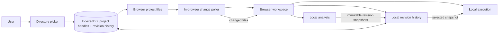

# Browser-Managed Source Files

## System Design

### The browser owns file access, analysis, history, and execution

The current workspace obtains its file catalog, analysis, revision snapshots, and execution from backend services (per the research doc). The target removes that server boundary: the browser opens project folders, reads source, and runs every workspace capability locally. Projects are selected with the browser directory picker; their directory handles are persisted in IndexedDB so projects can be restored across visits when browser permission is available. If access is unavailable, the saved project remains listed and the user reselects its folder, as specified by the PRD. Browser File System Access API support is required: browsers without `showDirectoryPicker()` receive an unsupported-browser state, not a weaker upload fallback that would lose persistent handles and automatic change detection. The existing external-change behavior is preserved: the backend currently polls every 250 ms and the frontend reacts to change events; in the target, the browser polls the open project and refreshes its local workspace state directly. Each detected change refreshes the file catalog and rebuilds analysis for affected files and dependencies. Immutable revision snapshots remain selectable, and execution uses the selected revision's snapshot rather than mutable current files, matching the existing revision-pinned execution flow described in the research doc. Browser-side revision history is persisted in IndexedDB, replacing the backend's durable history store and retaining history across visits.



Decided by: user


## Program Design

### The workspace controller depends on local ports; the composition root wires infrastructure

Keep the existing `LiveWorkspacePorts` injection seam, replacing HTTP-backed analysis, execution, and event adapters with local implementations. Add a project port for folder selection and saved handles. UI and controller code do not call browser file APIs directly.

```text
Browser composition root
  LiveWorkspaceController
    projects        -> BrowserProjectsPort
    analysis        -> AnalyzeProject module
    execution       -> LocalExecutionPort
    workspaceEvents -> LocalFileChangesPort

  AnalyzeProject module
    ProjectFiles interface   <- FileSystemProjectFiles adapter
    AnalysisWorker interface <- AnalysisWorkerClient
    RevisionHistory          <- IndexedDbRevisionHistory
```

```diff
browser/src/pages/liveWorkspace/useCases/live-workspace.ports.ts
+ projects: BrowserProjectsPort
- analysis: AnalysisGatewayPort
- execution: ExecutionPort
- workspaceEvents: WorkspaceEventsGatewayPort
+ analysis: AnalyzeProject
+ execution: LocalExecutionPort
+ workspaceEvents: LocalFileChangesPort

- browser/src/shared/api/analysis-gateway.ts
- browser/src/shared/api/execution-gateway.ts
- browser/src/shared/api/workspace-events-gateway.ts
+ browser/src/modules/                               # browser-local modules and adapters
```

### `AnalyzeProject` coordinates interfaces instead of owning file-system details

`AnalyzeProject` is the application module: it requests a source map through the `ProjectFiles` interface, delegates CPU analysis to an analysis-worker interface, and persists resulting snapshots through the history interface. The browser infrastructure adapter owns directory-handle access and path traversal; the module depends on interfaces, not those implementations.

```ts
interface ProjectFiles {
  readSourceMap(projectId: ProjectId): Promise<SourceMap>;
}

const createAnalyzeProject = ({ projectFiles, worker, revisions }: Dependencies) =>
  async (projectId: ProjectId) => {
    const files = await projectFiles.readSourceMap(projectId);
    const snapshots = await worker.analyze(files);
    await Promise.all(
      snapshots.map((snapshot) => revisions.save({ ...snapshot, projectId }))
    );
  };
```

Decided by: user

### Analysis and execution become browser-owned modules; the shared package workspace disappears

Move the former backend's CFG/analysis and execution capabilities under browser-owned modules, replacing Node-specific worker and crypto adapters with browser implementations. Remove the backend and `packages/` workspace directories; the browser becomes the sole application workspace. Delete HTTP-only request/response schemas, and move the workspace's remaining analysis, revision, and execution types into the corresponding browser modules' public entry points. Remove obsolete backend/contracts workspace and test-script references from the root manifest.

```diff
- backend/
- packages/
+ browser/src/modules/
+   analysis/       # analysis + CFG, revision models, worker adapter
+   execution/      # revision-pinned execution and execution models
+   project-files/  # browser directory access and source traversal
```


Decided by: user

### Directory handles establish project identity; IndexedDB keys only index records

Persist each selected directory handle alongside an internal project key. When the user selects a folder already saved, compare handles with `isSameEntry()`; do not use folder name or a filesystem path as identity. The internal key namespaces that project's revisions in IndexedDB.

```ts
type SavedProject = {
  id: string; // internal IndexedDB key
  name: string;
  handle: FileSystemDirectoryHandle;
};

const existing = await saved.handle.isSameEntry(pickedHandle);
```

Decided by: user

### Project IDs scope revision and query keys across saved projects

Relative paths repeat across projects, so include the internal `projectId` in the browser-owned revision key, each persisted snapshot, and all live-workspace query keys. This prevents one project's cached analysis, history, or execution from being displayed for another project.

```ts
type RevisionKey = {
  projectId: ProjectId;
  file: string;
  procedureId: string;
  revision: string;
};

const analysisKey = ["live-workspace", projectId, "analysis", file, procedureId, revision];
```

Decided by: user

### Project selection gates on the browser directory-picker capability

`BrowserProjectsPort` checks for `showDirectoryPicker()` when the user adds a project. If unavailable, it returns an unsupported result for the UI to explain; it does not fall back to file upload.

```ts
type AddProjectResult =
  | { status: "opened"; projectId: ProjectId }
  | { status: "unsupported" };
```

Decided by: user

### Polling uses file metadata as a fast path before reading changed content

The backend watcher scans source paths every 250 ms and compares file size plus modification time; it reads source and computes a content revision only when either value changes (`backend/src/modules/source/useCases/observeChanges/change-watcher.ts`). The browser poller follows that shape while a project is open, taking an initial baseline and then polling at the same 250 ms interval with `File.size` and `File.lastModified`; it updates changed paths and triggers affected analysis.

```text
for each .ts/.tsx file in the selected directory:
  if size or lastModified differs from prior scan:
    read text and compute content revision
    publish added/modified change
  else:
    reuse prior state
publish deletions for paths absent from this scan
```

Decided by: user

### Dedicated Web Workers keep local analysis and execution off the UI thread

The current backend already isolates procedure execution in a worker thread and supports worker-backed revision building (per the research doc). The browser-local adapters delegate CPU-heavy analysis and selected-revision execution to dedicated Web Workers; the workspace remains responsible for presenting their results and progress.

```text
LocalAnalysisPort
  -> AnalysisWorkerClient
       -> analysis.worker.ts
            -> build affected immutable revisions

LocalExecutionPort
  -> ExecutionWorkerClient
       -> execution.worker.ts
            -> run selected revision and stream node events
```

Decided by: user

### Revision history exposes one atomic save while deduplicating source content

Keep the history module's `save(snapshot)` as the single caller-facing operation. Its IndexedDB implementation content-addresses source text and atomically stores source records plus revision metadata that maps project paths to source hashes. `load` resolves those references to reconstruct the immutable snapshot required by revision selection and execution.

```ts
interface RevisionHistory {
  save(snapshot: AnalysisSnapshot & { projectId: ProjectId }): Promise<"inserted" | "existing">;
  load(key: RevisionKey): Promise<AnalysisSnapshot | undefined>;
}

// Internal IndexedDB transaction; callers only invoke save(snapshot).
transaction(["sources", "revisions"], "readwrite", () => {
  sources.put({ hash, text });
  revisions.put({ projectId, file, procedureId, revision, fileToHash, cfg });
});
```

Decided by: user

### The context rail uses `@pierre/trees` for accessible project-file navigation

Wrap the library in a workspace-owned `ProjectFileTree` that receives source paths, selected relative path, and a selection callback. The wrapper adapts the library's model to workspace selection and existing theme tokens; the library owns tree semantics, keyboard navigation, and row virtualization.

```tsx
<ContextRail>
  <ProjectSwitcher projects={projects} onSelect={selectProject} />
  <ProjectFileTree
    paths={sourcePaths}
    selectedPath={selection.file}
    onSelect={workspace.selectFile}
  />
</ContextRail>
```

`@pierre/trees` is currently beta, so pin and verify the chosen version against the wrapper's accessibility and selection needs.

Decided by: user

### Test assertions

```text
integration: open project and analyze
  boundary: project picker -> FileSystemProjectFiles -> AnalyzeProject -> history
  asserts: lists only .ts/.tsx paths and saves dependency-aware analysis snapshots

integration: update project externally
  boundary: directory scan -> LocalFileChangesPort -> workspace cache/revisions
  asserts: unchanged metadata avoids source reads; added/changed/deleted paths refresh affected workspace data

integration: execute selected revision
  boundary: workspace -> IndexedDB history -> execution worker
  asserts: runs the selected immutable snapshot, streams node updates, and cancellation terminates the run

unit: IndexedDbRevisionHistory
  boundary: history interface -> IndexedDB transaction
  asserts: save atomically persists deduplicated sources and reloads the complete project-scoped snapshot

acceptance: project lifecycle
  boundary: browser UI -> File System Access API
  asserts: add/switch/reopen saved projects; unavailable permission prompts reselection; unsupported picker shows guidance

static/build: browser-only workspace
  boundary: root workspace/build scripts -> browser application
  asserts: backend and packages workspaces, imports, and task references are absent
```

### Low-confidence decisions

- File System Access API support and permission persistence vary by browser; current browser tests are Chromium-only, not a declared support policy.
- `@pierre/trees` is beta; verify its API, accessibility behavior, and theming before adoption.
- Browser workers can be terminated on timeout/cancel but do not provide Node worker-thread memory limits; large or untrusted procedures may affect tab stability.
- The metadata gate can miss a same-size edit whose `lastModified` value does not change; this mirrors the current watcher behavior.
- IndexedDB quota and growth from immutable history need validation on representative project sizes; content-addressed storage reduces duplication but does not eliminate quota limits.

## Patterns to Follow

- Inject workspace dependencies through explicit ports: `browser/src/pages/liveWorkspace/useCases/live-workspace.ports.ts`.
- Keep change detection local and incremental: `backend/src/modules/source/useCases/observeChanges/change-watcher.ts` compares metadata before reading changed content.
- Keep deep module interfaces small and test through public entry points: `backend/src/modules/README.md`.
- Preserve immutable history reads and saves behind one interface: `backend/src/modules/analysis/revision-history.ts`.
