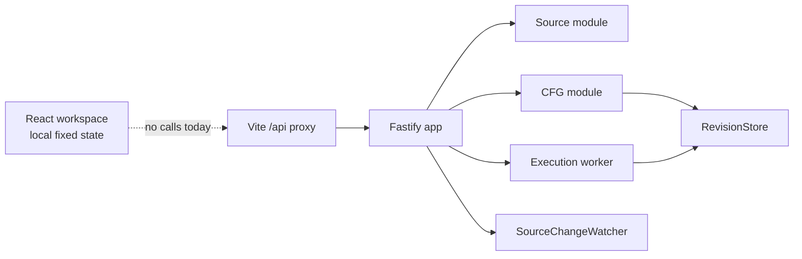
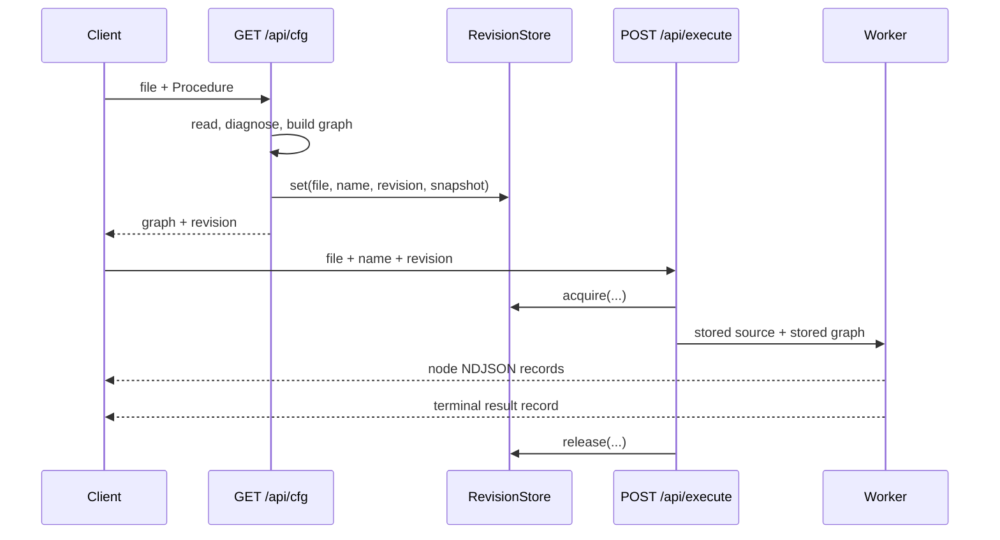

# The Browser and Backend Are Separate Implementations of the Same Domain

**Research date:** 2026-08-12  
**Scope:** Current frontend, backend, HTTP contracts, revision behavior, streams, tests, and design system  
**Source questions:** `01-research-questions-integration-plan.md`

## Executive summary

Runtime Visualizer has two substantial parts, but the browser does not consume the backend today.

- The browser renders one self-contained React workspace. Files, Procedures, source, graph structure, runs, revisions, diagnostics, and event entries are local values in one component (`browser/src/components/generated/LiveProcedureWorkspace.tsx:25-87`, `:169-217`).
- The backend exposes files, source, Procedure discovery, CFG analysis, revision-bound execution, and source-change events through Fastify (`backend/src/shared/infra/http/app.ts:71-106`).
- The development server already gives the browser a same-origin `/api` path through the Vite proxy (`browser/vite.config.ts:14-24`). No browser code calls that path.
- The root feature files define one domain across graph generation, imports, diagnostics, multi-file analysis, and execution highlighting. Backend tests exercise much of this behavior. Browser acceptance bindings describe a different form-based interface from the current workspace.
- Some visible browser concepts have no backend contract: run history, client execution IDs, elapsed event times, graph search and fit state, and workspace settings. Some backend concepts have no current browser representation: arbitrary CFG nodes and edges, structured diagnostics, revision conflicts, execution failures, and real file-change events.



## The browser is one local-state workspace

`main.tsx` applies animation and image behavior, forces light mode, and mounts `App` in React `StrictMode` (`browser/src/main.tsx:5-57`). `App` sets a fixed `light` theme and renders only `LiveProcedureWorkspace` (`browser/src/App.tsx:4-20`).

The production component tree is shallow:

```tsx
<App>
  <LiveProcedureWorkspace>
    <Header />                 // inline JSX
    <NavigationSidebar />      // inline JSX
      <FileSelect />
      <ProcedureSelect />
      <RunList />
    <Workspace />              // inline JSX
      <SourcePanel />
      <GraphNode /> * N
    <SelectedRunAside />       // inline JSX
    <DiagnosticsOverlay />     // inline JSX
```

Only `StatusIcon` and `GraphNode` are extracted functions (`browser/src/components/generated/LiveProcedureWorkspace.tsx:89-168`). The workspace does not use a router, context, API client, data hook, persistence adapter, or graph library.

### The displayed workspace data is fixed at module level

The component defines a six-color run palette, four initial runs, and 15 source lines before React renders (`browser/src/components/generated/LiveProcedureWorkspace.tsx:34-87`). Its state starts with `main.ts`, `prepare()`, run 7, imports visible, and a queued update (`:169-182`).

| Browser concept | Current source |
| --- | --- |
| Files | Three `<option>` values: `main.ts`, `billing/charge.ts`, `jobs/sync.ts` (`:287-296`) |
| Procedures | Four `<option>` values: `Top level`, `prepare()`, `classify()`, `run()` (`:301-314`) |
| Source | Fixed `sourceLines` array (`:72-87`) |
| Graph | Fixed `GraphNode` JSX and CSS connectors (`:527-580`) |
| Runs | Four fixed records plus locally-created records (`:42-70`, `:197-212`) |
| Revision | Fixed text `a91c4e` (`:380`, `:417`, `:639-640`) |
| Diagnostics | Five fixed status cards; only selection and queued-update text vary (`:694-717`) |
| Event stream | Three fixed entries (`:649-665`) |

Selecting a file only changes the file string, resets the Procedure to `Top level`, and clears the selected run (`browser/src/components/generated/LiveProcedureWorkspace.tsx:213-217`). Selecting a Procedure changes its string and clears the selected run (`:302-306`). Neither action changes the fixed source or graph.

`Run Procedure` adds a local record with status `running`, node `start`, the next numeric ID, a palette color, and the browser clock time (`browser/src/components/generated/LiveProcedureWorkspace.tsx:197-212`). No timer or event changes the node or status after creation.

### The graph is a fixed HTML composition

The graph uses cards and CSS line elements rather than a renderer that accepts a node and edge model. It contains `start`, `validate_input`, optional `classify.ts`, `prepare_payload`, `reject`, and `complete` (`browser/src/components/generated/LiveProcedureWorkspace.tsx:527-580`).

Running records become numbered markers when their `node` string equals a fixed graph-node label. A node shows at most two markers below 640 px and four markers at larger widths. Excess markers become `+N` (`browser/src/components/generated/LiveProcedureWorkspace.tsx:114-163`). The footer applies the same responsive limit to its live-run legend (`:180-196`, `:570-592`).

The source view shows the fixed source beside the graph. The imports switch filters lines that begin with `import` and adds or removes the fixed `classify.ts` node. It also changes fixed graph counts between `7 nodes · 7 edges` and `5 nodes · 5 edges` (`browser/src/components/generated/LiveProcedureWorkspace.tsx:187-189`, `:420-432`, `:507-510`, `:551-556`).

### Some controls update local state and some are presentation only

| Control | Current behavior |
| --- | --- |
| Mobile navigation | Opens and closes the sidebar (`LiveProcedureWorkspace.tsx:222-225`, `:273-278`) |
| Diagnostics controls | Open or close the overlay (`:255-258`, `:669-689`) |
| Run list | Expands, collapses, and selects local runs (`:328-374`) |
| Graph/source tabs | Change the local layout (`:435-463`) |
| Show imports | Filters fixed source and graph content (`:420-432`, `:551-556`) |
| Deferred refresh | Toggles `queueUpdate` (`:728-735`) |
| Workspace settings | No handler (`:263-268`) |
| Copy source | No handler (`:478-483`) |
| Search graph | No handler (`:514-519`) |
| Fit graph | No handler (`:520-525`) |
| `⌘↵` label | No keyboard handler (`:318-325`) |

## The backend already exposes the complete analysis and execution pipeline

`createApp()` creates one `RevisionStore` and one `SourceChangeWatcher`. CFG and execution routes share the store. All source-event clients share the watcher (`backend/src/shared/infra/http/app.ts:78-105`).

```text
createApp
  register source routes
    listSourceFiles
    readSource
    discoverProcedures
    SourceChangeWatcher
  register CFG routes
    read all TypeScript source files
    diagnoseProject
    analyseFileProcedure
    RevisionStore.set
  register execution route
    RevisionStore.acquire
    executeProcedure
      Worker
        instrument source
        run in VM
        emit node events
    RevisionStore.release
```

Fastify has a 64 KiB HTTP body limit. Its common error body is `{ error: string }`. `HttpError` keeps its status; other thrown errors become HTTP 500 (`backend/src/shared/infra/http/app.ts:33-67`).

### The HTTP boundary has resource and inline modes

| Endpoint | Request | Success |
| --- | --- | --- |
| `GET /api/files` | None | Sorted relative file paths (`backend/src/modules/source/useCases/listFiles/files.ts:12-19`) |
| `GET /api/source` | `file` query | `{ file, source, revision }` (`backend/src/modules/source/useCases/readSource/source.ts:23-31`) |
| `GET /api/procedures` | `file`; optional `name` | `{ file, revision, procedures, diagnostics? }` (`:33-47`) |
| `GET /api/cfg` | Optional `file`, `name`, `showImports` | Backend-owned `{ ok, file, revision, cfg }` (`backend/src/modules/cfg/useCases/analyseProject/cfg.ts:23-117`) |
| `POST /api/cfg` | `{ source, filePath?, functionName?, showImports?, files? }` | Inline `{ ok, cfg }` (`:120-144`) |
| `POST /api/execute` | Inline source body or `{ file, name?, revision }` | NDJSON node and result records (`backend/src/modules/execution/useCases/executeProcedure/execute.ts:9-42`, `:54-175`) |
| `GET /api/events` | None | SSE file-change stream (`backend/src/modules/source/useCases/observeChanges/events.ts:8-35`) |

Operational routes also expose health, runtime information, memory, uptime, and echo behavior (`backend/src/shared/infra/http/routes/health.ts:7-14`, `backend/src/shared/infra/http/routes/runtime.ts:28-68`, `backend/src/shared/infra/http/routes/echo.ts:10-23`).

### Files and Procedures are backend-owned resources

`GET /api/files` recursively returns regular files in deterministic order. It skips symbolic links and dot-prefixed directories and normalizes separators to `/` (`backend/src/modules/source/useCases/listFiles/list-files.ts:8-48`). This endpoint lists all files. CFG collection and file observation later restrict work to `.ts` and `.tsx` through `isSourceFile` (`:46-50`).

`readSource()` rejects absolute paths, `..`, root selection, and real-path escapes. It requires a regular non-symbolic-link file, reads UTF-8, and computes the revision as a SHA-256 source hash (`backend/src/modules/source/useCases/readSource/read-source.ts:7-95`).

Procedure discovery always returns the top-level Procedure. It then returns named function declarations with bodies in source order. Its public shape is:

```ts
type ProcedureResource = {
  id: string
  kind: "TopLevel" | "Function"
  name: string | null
  label: string
}
```

(`backend/src/modules/source/types.ts:1-12`, `backend/src/modules/source/useCases/discoverProcedures/discover-procedures.ts:8-50`)

A requested Procedure name that is not present is a successful response with available Procedures and a `Procedure was not found` diagnostic (`backend/src/modules/source/useCases/readSource/source.ts:33-47`).

## CFG analysis returns a general graph, not the browser's fixed layout

The public graph types are JSON-serializable. Nodes have a stable graph-local ID, kind, label, and optional source text and location. Edges identify source and target node IDs and can include a kind and label. A graph can contain file-level function metadata and Procedure graphs (`backend/src/modules/cfg/types.ts:1-131`).

```ts
type CfgNode = {
  id: string
  kind: CfgNodeKind
  label: string
  location?: { start: { line; column }; end: { line; column } }
  text?: string
}

type CfgEdge = {
  from: string
  to: string
  kind?: CfgEdgeKind
  label?: string
}
```

The analyser represents entry, exit, imports, statements, decisions, loop control, returns, throws, `try`, `catch`, and `finally` constructs (`backend/src/modules/cfg/types.ts:16-97`). The feature suite also specifies `switch`, loop variants, labeled breaks, generators, `await`, logical decisions, optional chains, and class initialization (`features/visualize-control-flow.feature:7-222`).

Imports are contextual nodes. They are hidden by default, have no execution edge, and do not expand imported Procedure bodies (`features/show-control-flow-imports.feature:7-22`, `CONTEXT.md:75-76`).

### Project diagnostics gate graph creation

Backend-owned CFG requests read the selected source and all `.ts` and `.tsx` files with up to eight concurrent reader loops (`backend/src/modules/cfg/useCases/analyseProject/cfg.ts:59-82`). `analyseProject()` diagnoses the TypeScript program before it builds the graph. Any diagnostic returns no CFG (`backend/src/modules/cfg/useCases/analyseProject/project-analyzer.ts:15-29`).

Diagnostics cover syntax errors, required-dependency resolution and type errors, selected-source type errors, and unsupported `with` statements. They can include Procedure, dependency, reason, message, and source location (`backend/src/modules/cfg/diagnostics.ts:12-113`). Unrelated project errors do not block the selected graph, as specified in `features/diagnose-control-flow-graph.feature:7-37`.

HTTP CFG analysis returns these failures as status 422. A successful backend-owned `GET /api/cfg` stores the complete selected snapshot for later execution (`backend/src/modules/cfg/useCases/analyseProject/cfg.ts:83-115`). Inline `POST /api/cfg` does not create a revision snapshot (`:120-141`).

## Revisions bind execution to the graph that the backend returned

A successful backend-owned CFG request stores:

```text
key:      file path + Procedure name + source revision
snapshot: selected source
          selected path and Procedure
          complete source-file map
          selected Procedure CFG
```

The store has a default limit of 100 entries and a five-minute age limit (`backend/src/modules/execution/infra/revision-store.ts:15-32`). Expiry is lazy during `set` and `acquire`. An active reference prevents age and capacity eviction (`:34-89`). Multiple executions can acquire the same snapshot.

Revision execution first confirms that the backing file still exists. It then acquires and executes the stored source and graph (`backend/src/modules/execution/useCases/executeProcedure/execute.ts:77-106`). It does not compare current file content with the stored hash. Therefore, an existing file can change while execution continues to use the displayed snapshot. A deleted backing file causes HTTP 409 `Revision unavailable`.



Integration tests cover unknown revisions, deleted backing files, execution against an older displayed revision after a file update, and two concurrent runs of one revision (`backend/tests/typical/integration/run-procedure-revision.integration.ts:18-153`).

## Execution and file observation use different stream formats

### Execution is an NDJSON response with one terminal result

Each execution creates a worker thread with memory and stack limits (`backend/src/modules/execution/useCases/executeProcedure/runner.ts:22-38`). Instrumented code emits node IDs in runtime order. The worker posts a successful result after synchronous or promised completion and a failed result after an exception (`backend/src/modules/execution/useCases/executeProcedure/execution-worker.ts:30-74`).

The HTTP response is `application/x-ndjson` with zero or more node records and one terminal result:

```json
{"event":"node","data":{"nodeId":"statement-2"}}
{"event":"result","data":{"status":"Succeeded"}}
```

A runtime failure remains an HTTP 200 stream with a final `Failed` result and optional error. Pre-execution diagnostics use HTTP 422. Unavailable revisions use HTTP 409 (`backend/src/modules/execution/useCases/executeProcedure/execute.ts:107-175`).

The parent keeps worker message order and settles once on a result, worker error, early exit, or the 30-second timeout. Settlement terminates the worker (`backend/src/modules/execution/useCases/executeProcedure/runner.ts:40-75`). The HTTP stream has no cancellation handler. If the client disconnects, writes stop when the stream controller closes, but the worker continues to its terminal state or timeout before the snapshot is released (`backend/src/modules/execution/useCases/executeProcedure/execute.ts:128-170`).

### File changes are shared SSE events

`GET /api/events` sends an initial `: connected` comment and then named SSE events:

```text
event: file-change
data: {"type":"file-changed","file":"main.ts","change":"modified","revision":"..."}
```

(`backend/src/modules/source/useCases/observeChanges/events.ts:12-35`)

One watcher polls every 250 ms while at least one subscriber exists. A guard prevents concurrent refreshes (`backend/src/modules/source/useCases/observeChanges/change-watcher.ts:20-55`). The first refresh establishes a baseline without events. Later refreshes emit additions and modifications before deletions. Added and modified records include a revision; deleted records do not (`:57-103`). Disconnect removes that subscriber, and the last unsubscribe stops polling.

File-change events do not invalidate snapshots. Revision execution remains independent of watcher events.

## Development uses a same-origin proxy; production topology is not recorded

The backend listens on `HOST`, default `0.0.0.0`, and `PORT`, default `3000` (`backend/src/index.ts:3-13`). The root development command starts Vite on port 5173 and Fastify on port 3000 (`README.md:5-11`).

Vite proxies `/api` to `127.0.0.1:3000` or `VITE_API_PORT`, with `changeOrigin: false` (`browser/vite.config.ts:14-24`). The Fastify app does not register a CORS plugin or emit CORS policy headers. The current browser-backend development seam is therefore same-origin from browser code.

The server gets `filesFolder` from an explicit `createApp` option or from the nearest ancestor `settings.json`. Relative folder values resolve from that settings file (`backend/src/shared/infra/config/settings.ts:27-39`, `:78-97`).

`PRODUCT.md` records the execution connection contract, authentication, persistence, and deployment as open product decisions rather than implemented system behavior (`PRODUCT.md:49-51`).

## The design system uses a dark control-room shell with scarce live color

`DESIGN.md` defines a dense green-black workspace. Emerald indicates live state and primary action. Monospace text carries source, revision, time, and node data (`DESIGN.md:149-174`). Graph nodes use a dark green surface, hairline border, 12 px corners, and small numbered run markers. Active nodes use an emerald border and active surface (`DESIGN.md:201-218`).

The component follows much of that visual language with fixed dark hex surfaces, white-alpha borders, Slate text, Emerald action and live state, Amber queued state, Rose failures, and Sky running states (`browser/src/components/generated/LiveProcedureWorkspace.tsx:218-219`, `:251-267`, `:360-365`, `:387-402`).

`index.css` imports Inter and IBM Plex Mono and defines semantic light and dark OKLCH tokens (`browser/src/index.css:1-4`, `:20-129`). The workspace mostly uses direct Tailwind utilities and fixed hex values instead of those semantic variables. `main.tsx` and `App.tsx` force light theme behavior, although the workspace surface itself is dark (`browser/src/main.tsx:15-24`, `:44-52`; `browser/src/App.tsx:4-15`).

Responsive behavior includes an off-canvas sidebar below `lg`, stacked source and graph below `xl`, a run inspector only above 1180 px, and reduced marker counts below 640 px (`browser/src/components/generated/LiveProcedureWorkspace.tsx:180-196`, `:222-225`, `:468-472`, `:598-600`). Native buttons, selects, labels, tab roles, `aria-selected`, `aria-expanded`, marker labels, and focus styles provide the primary accessibility semantics (`:223-225`, `:284-314`, `:328-342`, `:420-459`).

## The specifications describe one domain, but browser bindings target another UI shape

The root feature suite is the main behavioral record:

| Feature | Current contract |
| --- | --- |
| `visualize-control-flow.feature` | Complete possible flow, source locations, TypeScript control constructs, and Procedure boundaries (`features/visualize-control-flow.feature:7-222`) |
| `show-control-flow-imports.feature` | Imports hidden by default and shown only as unconnected context (`features/show-control-flow-imports.feature:7-22`) |
| `diagnose-control-flow-graph.feature` | Complete diagnostics and no partial graph (`features/diagnose-control-flow-graph.feature:7-37`) |
| `compose-multi-file-program.feature` | Selected source and dependencies form one TypeScript program (`features/compose-multi-file-program.feature:7-12`) |
| `observe-execution.feature` | Full graph remains visible; current node advances; highlighting clears at completion (`features/observe-execution.feature:7-25`) |
| `backend/features/observe-procedure-changes.feature` | Added, modified, and deleted source events; revisions on modifications (`backend/features/observe-procedure-changes.feature:10-25`) |

Backend tests use four principal levels:

1. Typical unit tests call the analyser directly (`backend/tests/typical/unit/file-analyzer.unit.ts`).
2. Typical integration tests create temporary folders and a real Fastify app, then use `app.inject()` for JSON and NDJSON (`backend/tests/typical/integration/`).
3. SSE integration tests start a real ephemeral listener and use real `fetch`, streams, and filesystem mutations (`backend/tests/typical/integration/source-change.integration.ts:14-149`).
4. Acceptance HVUT tests bind Gherkin with `@amiceli/vitest-cucumber` and use real analyser, HTTP, and filesystem seams (`backend/tests/acceptance/unit/`).

Browser HVE2E tests use `playwright-bdd`, one Chromium worker, generated tests, and both backend and frontend web servers (`browser/playwright.config.ts:4-40`). They verify roles, accessible names, test IDs, graph nodes, transitions, diagnostics, import nodes, and `aria-current="step"` execution state (`browser/tests/acceptance/e2e/`).

The browser bindings expect editable `File 1` fields, a `Visualize control flow` action, `control-flow-graph` test IDs, graph-node lists, and transition lists (`browser/tests/acceptance/e2e/visualize-control-flow.hve2e.ts:88-173`, `:195-266`). Those structures are not present in `LiveProcedureWorkspace`, which uses fixed selects, a fixed HTML graph, and `Run Procedure` (`browser/src/components/generated/LiveProcedureWorkspace.tsx:197-217`, `:282-325`). The bindings and current component therefore document two different browser interface shapes.

## The current capability boundary is explicit

| Capability | Browser today | Backend today |
| --- | --- | --- |
| File list | Fixed options | Filesystem resource |
| Procedure list | Fixed options | Parsed TypeScript resource |
| Source | Fixed lines | UTF-8 source with SHA-256 revision |
| Graph | Fixed HTML nodes | General node-and-edge CFG |
| Imports | Local fixed visibility | Optional contextual CFG nodes |
| Diagnostics | Fixed status cards | Structured analysis diagnostics |
| Execution | Local run record | Revision-bound worker and NDJSON events |
| Run history | Local component state | No history resource |
| File changes | Local simulation | Shared SSE watcher |
| Client execution ID | Fixed display convention | No corresponding field |
| Event elapsed time | Fixed display values | Ordered events without timestamps |
| Health/runtime | No display | Operational endpoints |

This boundary explains the present state without assigning future ownership. The browser models the intended operator experience. The backend models source, analysis, revision, execution, and file-observation behavior. The Vite proxy is the only implemented connection between their runtime environments.

## Code references

### Browser workspace — exhaustive production files

- `browser/src/main.tsx` — document setup and React mount.
- `browser/src/App.tsx` — fixed theme and workspace root.
- `browser/src/components/generated/LiveProcedureWorkspace.tsx` — all workspace data, state, controls, graph, source, runs, and diagnostics.
- `browser/src/index.css` — fonts, Tailwind setup, and semantic tokens.
- `browser/src/settings/theme.ts` — injected theme and layout settings.
- `browser/vite.config.ts` — plugins and `/api` development proxy.

### Backend HTTP and configuration — exhaustive route surface

- `backend/src/index.ts` — host, port, listener, and shutdown.
- `backend/src/shared/infra/http/app.ts` — Fastify composition and shared objects.
- `backend/src/shared/infra/http/routes/health.ts`
- `backend/src/shared/infra/http/routes/runtime.ts`
- `backend/src/shared/infra/http/routes/echo.ts`
- `backend/src/shared/infra/config/settings.ts`
- `backend/src/modules/source/http.ts`
- `backend/src/modules/cfg/http.ts`
- `backend/src/modules/execution/http.ts`

### Source, CFG, revision, execution, and observation — key implementation files

- `backend/src/modules/source/useCases/listFiles/`
- `backend/src/modules/source/useCases/readSource/`
- `backend/src/modules/source/useCases/discoverProcedures/discover-procedures.ts`
- `backend/src/modules/source/useCases/observeChanges/`
- `backend/src/modules/source/types.ts`
- `backend/src/modules/cfg/types.ts`
- `backend/src/modules/cfg/diagnostics.ts`
- `backend/src/modules/cfg/useCases/analyseFile/file-analyzer.ts`
- `backend/src/modules/cfg/useCases/analyseProject/`
- `backend/src/modules/execution/infra/revision-store.ts`
- `backend/src/modules/execution/useCases/executeProcedure/`

### Specifications and tests — exhaustive researched feature surface

- `features/visualize-control-flow.feature`
- `features/show-control-flow-imports.feature`
- `features/diagnose-control-flow-graph.feature`
- `features/compose-multi-file-program.feature`
- `features/observe-execution.feature`
- `backend/features/observe-procedure-changes.feature`
- `backend/tests/typical/unit/file-analyzer.unit.ts`
- `backend/tests/typical/integration/`
- `backend/tests/acceptance/unit/`
- `browser/tests/acceptance/e2e/`
- `backend/vitest.config.ts`
- `browser/playwright.config.ts`

### Product and domain records

- `CONTEXT.md` — domain vocabulary and graph semantics.
- `PRODUCT.md` — product capabilities, constraints, and unestablished decisions.
- `DESIGN.md` — visual system and responsive workspace behavior.
- `README.md` — local commands and public operational endpoints.
